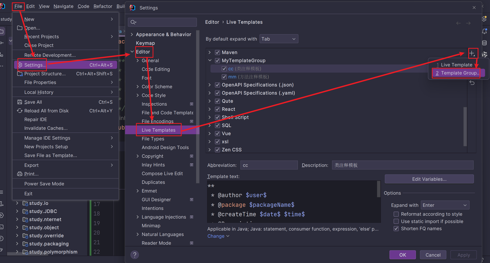
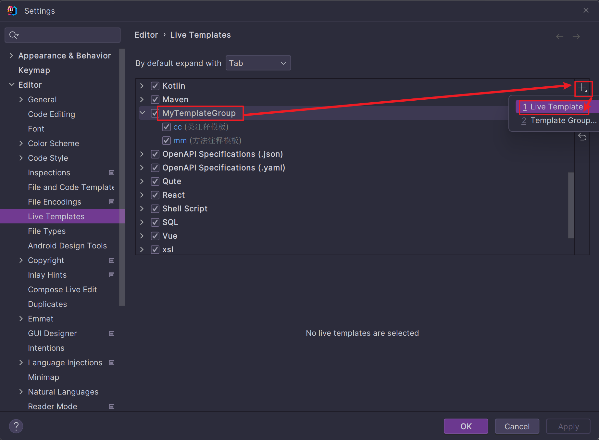
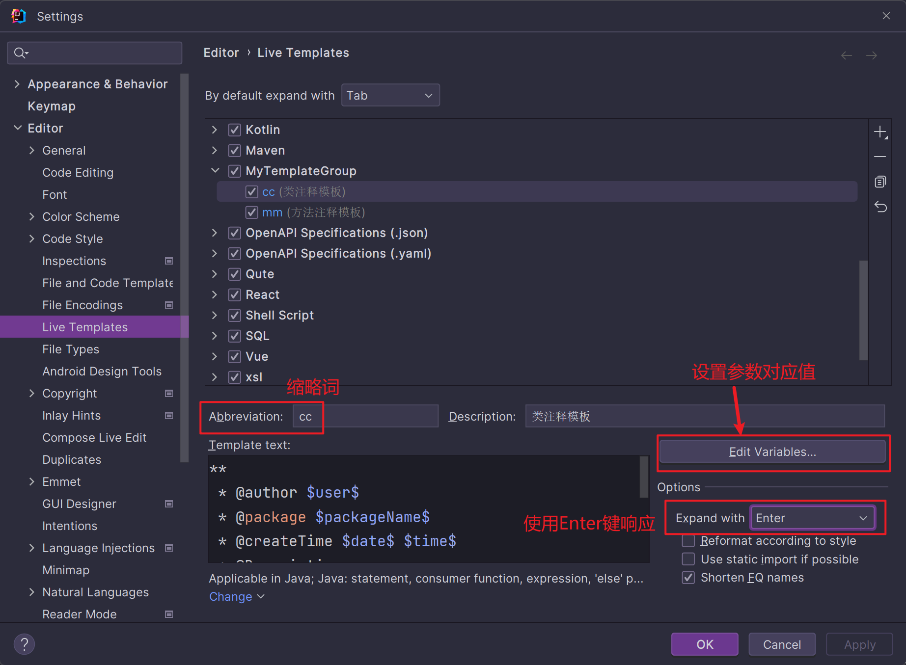
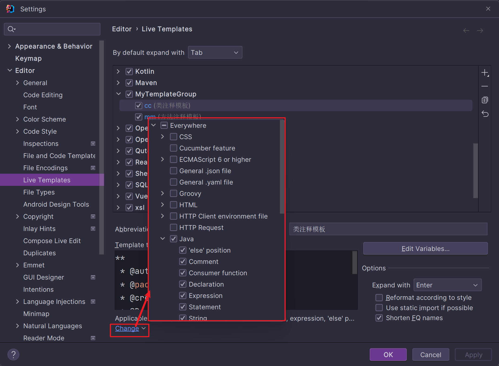
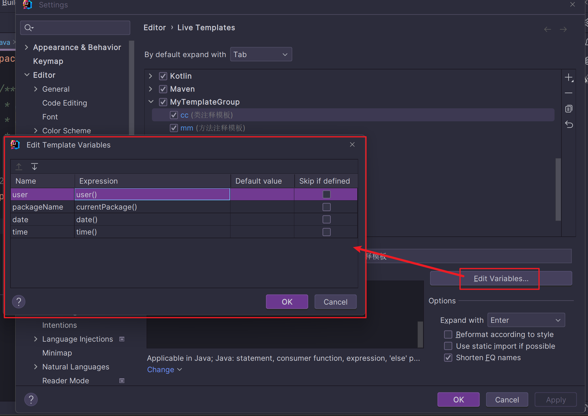
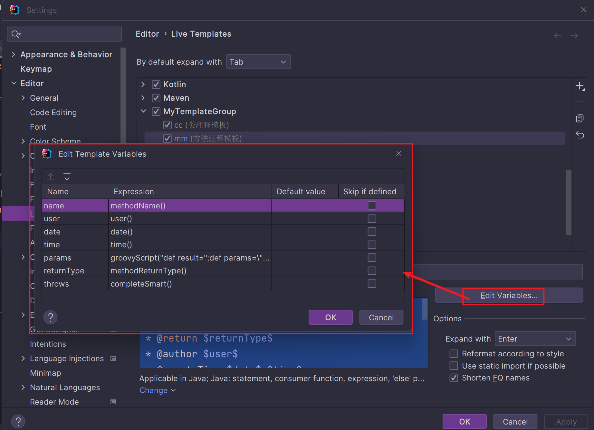

# 快捷键

参考 [IDEA快捷键](../../../keyboard%20shortcuts/IDEA快捷键.md) 使用 `CTRL + /` 为单行注释，使用 `CTRL+ SHIFT + /` 为多行注释

# 注释模板

想要在IDEA中配置特定的注释模板，需要先创建一个分组，专门用于存放自定义的注释模板



我的IDEA中，模板分组叫 **MyTemplateGroup**，选中模板分组后点击加号，再选择 **Live Template** 添加注释模板



## 类注释模板

在Template Text中写类注释模板，内容如下所示

```Java
**
 * @author $user$
 * @package $packageName$
 * @createTime $date$ $time$
 * @Description 
 */
```

**Abbreviation** 为缩略词，通过缩略词可快速使用该注释模板，例如类注释模板的缩略词是cc，则输入`/cc`便可快速使用此注释模板



点击模板页面最下方的警告，来设置将模板应用于那些场景，一般选择EveryWhere-->Java即可（如果曾经修改过，则显示为change而不是define）



选择右侧的Edit variables按钮，需要为每个参数选择对应的方法



完成后，在类名上敲出 `/cc` 即可使用类注释模板

## 方法注释模板

在Template Text中写方法注释模板，内容如下所示

```java
**
$params$
 * @return $returnType$ 
 * @author $user$
 * @createTime $date$ $time$
 * @Name $name$
 * @throw $throws$      
 * @Description 
 */
```

**Abbreviation** 为缩略词，通过缩略词可快速使用该注释模板，例如方法注释模板的缩略词是mm，则输入`/cc`便可快速使用此注释模板


点击模板页面最下方的警告，来设置将模板应用于那些场景，一般选择EveryWhere-->Java即可（如果曾经修改过，则显示为change而不是define）


选择右侧的Edit variables按钮，需要为每个参数选择对应的方法（方法注释模板由于设置到了该方法的参数与返回值类型，故而要特殊一些）

返回值：`groovyScript("def result='';def params=\"${_1}\".replaceAll('[\\\\[|\\\\]|\\\\s]', '').split(',').toList();for(i = 0; i < params.size(); i++){result+=' * @param ' + params[i] + ((i < params.size() - 1) ? '\\n' : '')};return result",methodParameters())`

返回值类型：`methodReturnType()`



完成后，在类名上敲出 `/mm` 即可使用类注释模板
