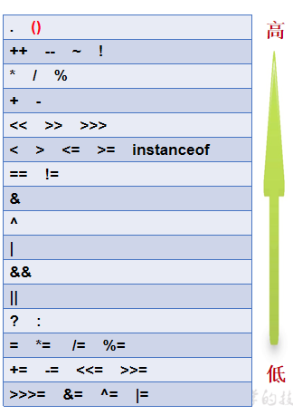

# 算数运算符

| 符号  | 说明                                                   |
| --- | ---------------------------------------------------- |
| +   | 加法（任何类型的数据遇到字符串都会变成字符串，此时+就不再是运算了，而是字符串拼接，将内容直接往后拼接） |
| -   | 减法                                                   |
| *   | 乘法                                                   |
| /   | 除法 如果符号前后都是整数,结果取整数部分 如果符号前后有一个为小数,结果就是正常小数    |
| %   | 模,取余数部分                                              |

## 自增、自减

> 变量++ => 后自加
>
> ++变量 => 前自加
>
> 变量-- => 后自减
>
> --变量 => 前自减

自增和自减只变化1

符号在前：先运算，再使用运算后的值

符号在后：先使用原值，使用完毕之后，自身再运算

# 赋值运算符

| 符号 | 说明                                                         |
| ---- | ------------------------------------------------------------ |
| =    | 先看等号右边的,再将右边的数据赋值给等号左边的变量            |
| +=   | 把运算符左侧的变量拿来与右侧的变量或数值相加，得出的新值重新赋值给左侧的变量 |
| -=   | 把运算符左侧的变量拿来减去右侧的变量或数值，得出的新值重新赋值给左侧的变量 |
| /=   | 把运算符左侧的变量拿来除以右侧的变量或数值，得出的新值取整数重新赋值给左侧的变量 |
| *=   | 把运算符左侧的变量拿来乘以右侧的变量或数值，得出的新值重新赋值给左侧的变量 |
| %=   | 把运算符左侧的变量拿来除以右侧的变量或数值，得出的新值取余数重新赋值给左侧的变量 |

注意：byte、short遇到复合赋值运算符，jvm会自动转型

# 关系运算符（比较运算符）

| 符号 | 说明                                                       |
| ---- | ---------------------------------------------------------- |
| ==   | 如果符号前后相等为true;否则为false                         |
| >    | 如果符号前的数据大于符号后的数据为true,否则为false         |
| <    | 如果符号前的数据小于符号后的数据为true,否则为false         |
| >=   | 如果符号前的数据大于或者等于符号后的数据为true,否则为false |
| <=   | 如果符号前的数据小于或者等于符号后的数据为true,否则为false |
| !=   | 如果符号前后不相等为true;否则为false                       |

关系运算符的比较结果是boolean型 => 要么是true，要么是false

# 逻辑运算符

| 符号       | 说明                                                         |
| ---------- | ------------------------------------------------------------ |
| \|\|(或者) | 有真则真,符号前后有一个结果为true,整体就是true               |
| !(非,取反) | 不是true,就是false;不是false,就是true                        |
| ^(异或)    | 符号前后结果一样为false;不一样为true true^true -> false true^false -> true false^true -> true false^false -> false |
| &          | 1.单与,如果前后都是布尔型,有假则假,但是如果符号前为false,符号后的判断会继续执行 2.如果该符号前后都是数字,看做是位运算符 |
| &&         | 双与,有假则假,但是有短路效果,如果符号前为false,符号后的判断就不会执行了 |
| \|         | 1.单或,如果前后都是布尔型,有真则真,但是如果符号前为true,符号后的判断会继续执行 2.如果该符号前后都是数字,看做是位运算符 |
| \|\|       | 双或,有真则真,但是有短路效果,如果符号前为true,符号后的判断就不会执行了 |

# 三元运算符

格式：`boolean表达式?表达式1:表达式2`

执行流程：先判断，如果是true，就走`?`后面的表达式1，否则就走`:`后面的表达式2

# 位运算符

| 符号 | 说明                                                         |
| ---- | ------------------------------------------------------------ |
| &    | 1.单与,如果前后都是布尔型,有假则假,但是如果符号前为false,符号后的判断会继续执行 2.如果该符号前后都是数字,看做是位运算符 |
| \|   | 1.单或,如果前后都是布尔型,有真则真,但是如果符号前为true,符号后的判断会继续执行 2.如果该符号前后都是数字,看做是位运算符 |
| ~    | 按位非，将操作数的每个位（包括符号位）全部取反               |
| ^    | 按位异或，当两位相同时返回0，不同时返回1                     |
| <<   | 左移运算符，左移几位就相当于乘以2的几次方（当左移的位数n超过该数据类型的总位数时，相当于左移（n-总位数）位） |
| >>   | 右移运算符，类似于除以2的n次，如果不能整除，**向下取整**     |
| >>>  | 无符号右移运算符，往右移动后，左边空出来的位直接补0，不管最高位是0还是1空出来的都拿0补 |

# 运算符优先级

