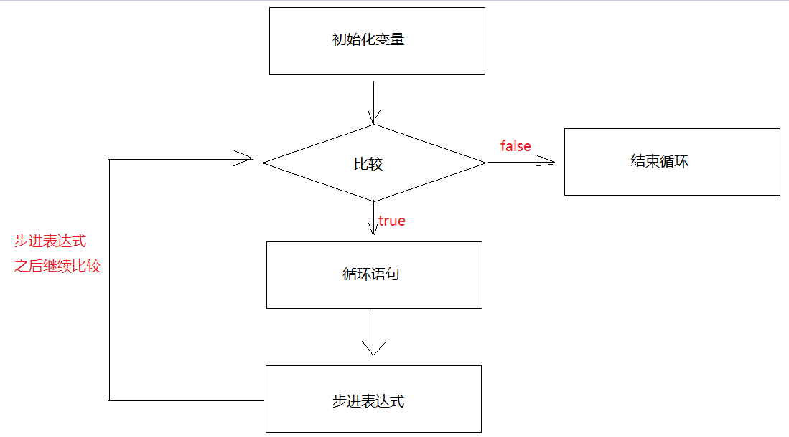

# switch（选择语句）

基本语法如下：

```java
switch(变量){
    case 常量值1:
        执行语句1;
        break;
    case 常量值2:
        执行语句2;
        break;
    case 常量值3:
        执行语句3;
        break;
    case 常量值4:
        执行语句4;
        break;
        ...
    default:
        执行语句n;
        break;
}
```

说明：用变量接收的值和下面case后面的常量值匹配，匹配上哪个case就执行哪个case对应的执行语句。如果以上所有case都没有匹配上，就走default对应的执行语句n

说明：每个 `case` 标签下的代码块实际上是在同一个作用域内。这意味着如果你在一个 `case` 中声明了一个局部变量，在另一个 `case` 中不能重新声明同名的变量

break关键字：代表的是结束switch语句

switch可匹配的数据类型：**byte、short、int、char、枚举类型、String类型**

案例如下：

```java
public class Demo01Switch {
    public static void main(String[] args) {
        Scanner sc = new Scanner(System.in);
        System.out.println("请您输入一个整数:");
        int data = sc.nextInt();
        switch (data){
            case 1:
                System.out.println("鹅鹅鹅");
                break;
            case 2:
                System.out.println("曲项向天歌");
                break;
            case 3:
                System.out.println("白毛浮绿水");
                break;
            case 4:
                System.out.println("红掌拨清波");
                break;
            default:
                System.out.println("下面没有了");
                break;
        }
    }
}
```

## case穿透性

如果没有break，就会出现case的穿透性，程序就一直往下穿透执行，直到遇到了break或者switch代码执行完毕了，就停止了

案例如下，可执行观察结果

```java
public class Demo02Switch {
    public static void main(String[] args) {
        Scanner sc = new Scanner(System.in);
        int data = sc.nextInt();
        switch (data){
            case 1:
                System.out.println("鹅鹅鹅");
            case 2:
                System.out.println("曲项向天歌");
            case 3:
                System.out.println("白毛浮绿水");
            case 4:
                System.out.println("红掌拨清波");
                break;
            default:
                System.out.println("下面没有了");
                break;
        }
    }
}
```

# 分支语句

## if语句

基本语法：

```java
if(boolean表达式){
    执行语句;
}
```

说明：先走if后面的boolean表达式，如果是true，就走if后面大括号中的执行语句，否则就不走

注意：if后面跟的是boolean表达式，只要是结果为boolean型的，都可以放在小括号中，哪怕直接写一个true或者false

案例：

```java
public class Demo01If {
    public static void main(String[] args) {
        Scanner sc = new Scanner(System.in);
        int data1 = sc.nextInt();
        int data2 = sc.nextInt();
        if (data1==data2){
            System.out.println("两个整数相等");
        }
    }
}
```

## if...else语句

基本语法：

```java
if(boolean表达式){
    执行语句1;
}else{
    执行语句2;
}
```

说明：先走if后面的boolean表达式，如果是true，就走if后面的执行语句1，否则就走else后面的执行语句2

案例：

```java
public class Demo02IfElse {
    public static void main(String[] args) {
        Scanner sc = new Scanner(System.in);
        int data1 = sc.nextInt();
        int data2 = sc.nextInt();
        if (data1 == data2){
            System.out.println("两个整数相等");
        }else{
            System.out.println("两个整数不相等");
        }
    }
}
```

## if...else if语句

基本语法：

```java
if(boolean表达式){
    执行语句1
}else if(boolean表达式){
    执行语句2
}else if(boolean表达式){
    执行语句3
}...else{
    执行语句n
}
```

说明：从if开始往下挨个判断，哪个if判断结果为true，就走哪个if对应的执行语句，如果以上所有的判断都是false，就走else对应的执行语句n

注意：最后一种情况不一定要用else，但一定要确保所有情况都判断到了

案例：

```java
public class Demo08ElseIf {
    public static void main(String[] args) {
        Scanner sc = new Scanner(System.in);
        int data1 = sc.nextInt();
        int data2 = sc.nextInt();
       /* 
	    if (data1>data2){
            System.out.println("data1大于data2");
        }else if(data1<data2){
            System.out.println("data1小于data2");
        }else{
            System.out.println("data1等于data2");
        }
        */

        if (data1 > data2){
            System.out.println("data1大于data2");
        }else if(data1 < data2){
            System.out.println("data1小于data2");
        }else if (data1 == data2){
            System.out.println("data1等于data2");
        }
    }
}
```

# 循环语句

## for循环

基本语法：

```java
for(初始化变量;比较;步进表达式){
    循环语句 -> 哪段代码循环执行，就将哪段代码放到此处
}
```

说明：先走初始化变量，比较，如果是true，走循环语句，走步进表达式(初始化的变量的值进行变化) ，再比较，如果还是true，继续走循环语句，走步进表达式，再比较，直到比较为false，循环结束了

图示：



案例：

```java
public class Demo01For {
    public static void main(String[] args) {
        for(int i = 0; i < 3; i++){
            System.out.println("我爱java");
        }
    }
}
```

## while循环

基本语法：

```java
初始化变量;
while(比较){
    循环语句;
    步进表达式
}
```

说明：初始化变量，比较，如果是true，就走循环语句，走步进表达式。再比较，如果还是true，继续走循环语句，继续走步进表达式。直到比较结果为false时，循环结束

案例：

```java
public class Demo01While {
    public static void main(String[] args) {
        int i = 0;
        while(i < 5){
            System.out.println("我爱java，我更爱钱");
            i++;
        }
    }
}
```

## do...while循环

基本语法：

```java
do{
    循环语句;
    步进表达式
}while(比较);
```

说明：初始化变量，走循环语句，走步进表达式，判断，如果是true，继续循环，直到比较为false，循环结束

相较于 [while循环](#while循环)，其特点在于至少会执行一次循环语句

案例：

```java
public class Demo01DoWhile {
    public static void main(String[] args) {
        int i = 0;
        do{
            System.out.println("我爱java");
            i++;
        }while(i < 5);
    }
}
```

# 循环控制关键字

## break

- 在switch中代表结束switch语句
- 在循环中代表结束循环

## continue

- 结束当前本次循环，直接进入到下一次循环，直到条件为false为止

案例：

```java
public class Demo01BreakAndContinue {
    public static void main(String[] args) {
        for (int i = 1; i <= 5; i++) {
            if (i == 3){
                //结束循环
                //break;
                //结束本次循环，进入下一次循环
                continue;
            }
            System.out.println("我爱java"+i);
        }
    }
}
```

# 死循环

当比较条件一直是true的时候，循环会陷入死循环状态，即一直循环无法结束

案例：

```java
public class Demo01Endless {
    public static void main(String[] args) {
        int count = 0;
        for (int i = 0; i < 10;) {
            count++;
            System.out.println("我爱java" + count);
        }

       /* 
       while(true){
       		count++;
       		System.out.println("我爱java"+count);
       }
       */
        
    }
}
```

# 嵌套循环

循环中包含另一个循环即为嵌套循环

说明：先执行外层循环，再进入内层循环，内层循环就一直循环，直到内层循环结束，外层循环进入下一次循环，直到外层循环都结束了，整体结束

案例：

```java
public class Demo02Nest {
    public static void main(String[] args) {
        for (int fen = 0; fen < 60; fen++) {
            for (int miao = 0; miao < 60; miao++) {
                System.out.println(fen + "分" + miao + "秒");
            }
        }
    }
}
```

案例：打印直角三角形

```java
public class Demo04Nest {
    public static void main(String[] args) {
        for (int i = 1; i < 5; i++) {
            for (int j = 0; j < i; j++){
                System.out.print("* ");
            }
            System.out.println();
        }
    }
}
```

