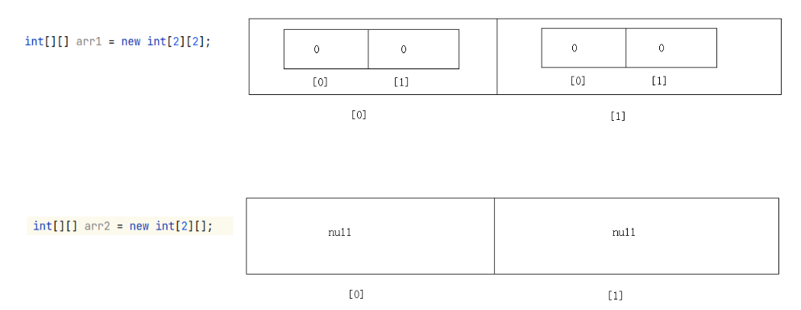
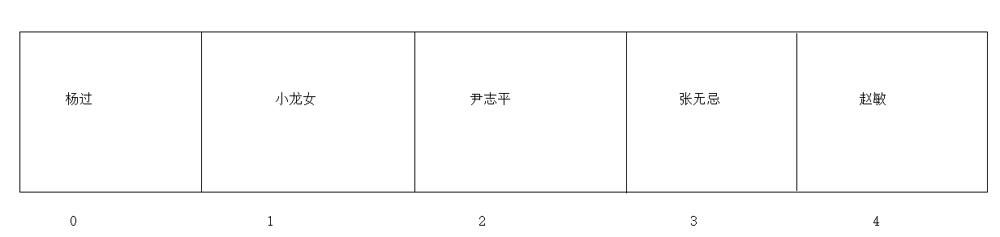
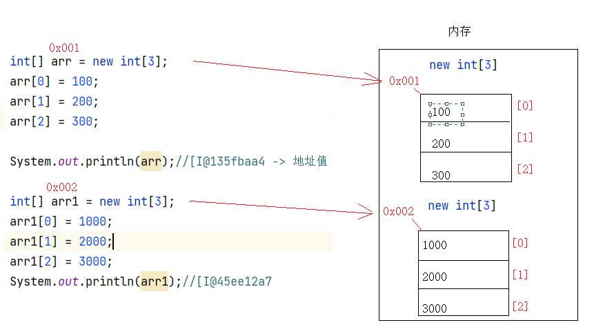
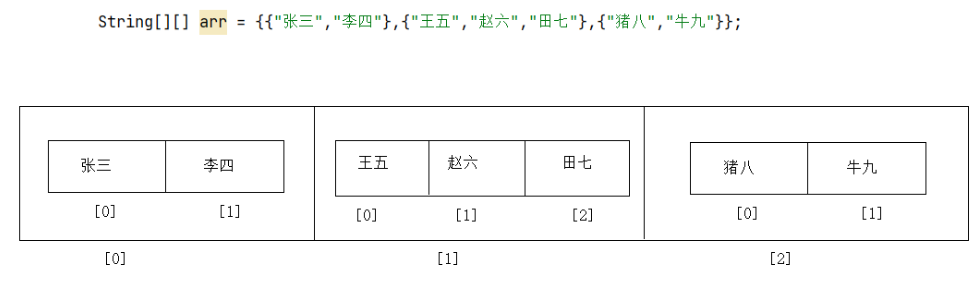
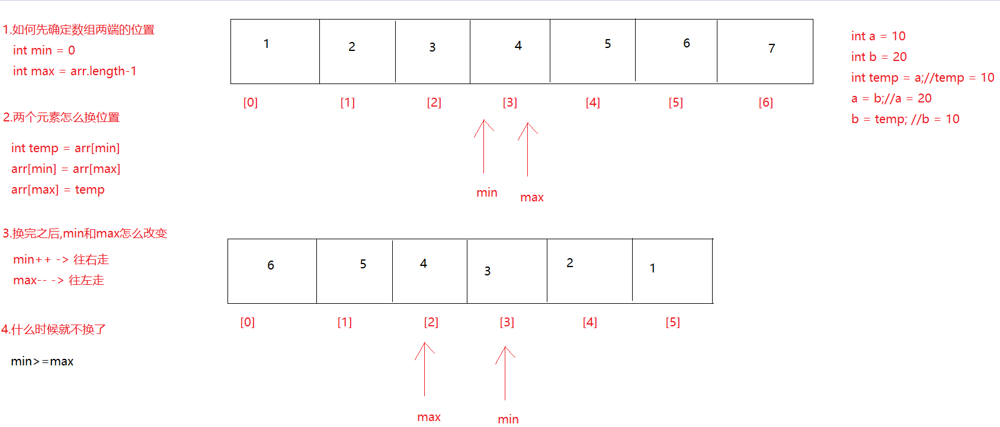
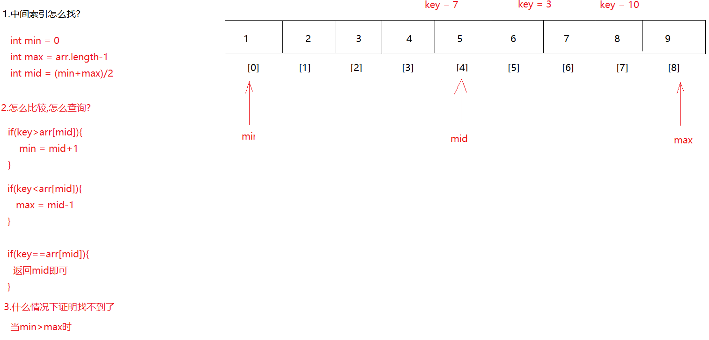
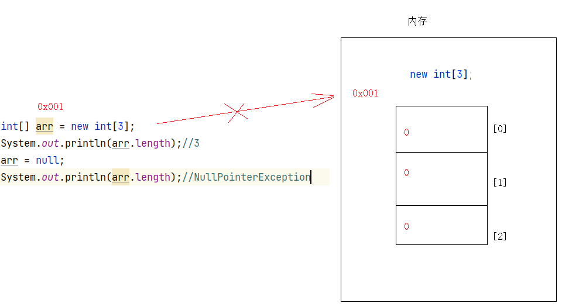

# 一维数组

[变量](20.常量、变量、标识符.md#变量) 只能用于保存一个数据，而想要保存多个数据，可以使用数组。

概述：数组是一个容器，其本身属于引用数据类型。作用在于可以一次性存储多个数据

特点：

1. 既可以存储基本类型的数据，还能存储引用类型的数据
2. 数组当中的多个数据，其类型必须统一
3. 定长（定义数组时长度为多长，最多就能存多少个数据，在程序运行期间不可改数组长度）

基本语法：

```java
//动态初始化
数据类型[] 数组名 = new 数据类型[长度];
数据类型 数组名[] = new 数据类型[长度];

//静态初始化
数据类型[] 数组名 = new 数据类型[]{元素1,元素2,元素3...};
数据类型 数组名[] = new 数据类型[]{元素1,元素2,元素3...};

//简化的静态初始化
数据类型[] 数组名 = {元素1,元素2,元素3...};
```

说明：

1. 动态初始化与静态初始化的区别在于：动态初始化定义时只指定了长度，没有存具体的数据。而静态初始化在定义时就存入了具体的数据
2. `数据类型[] 数组名`这种定义写法是Java所推荐的，更符合Java编程习惯，即数组类型为`数据类型[]`，而数组名就是该类型的一个实例
3. `数据类型 数组名[]`这种定义写法虽然也可以，但更多是收到了C和C++的影响，这种写法中，`数组名[]`是该类型的一个实例，且表示该变量是一个数组

注意：

1. 虽然静态初始化是没有定义长度的，但是根据大括号里面的内容，也可以推出数组的长度，静态初始化的数组不是没有长度的
2. 静态初始化的定义可以拆分成两个步骤，动态初始化的定义也可以拆分成两个步骤，但简化的静态初始化不能拆分为两个步骤了

案例：

```java
public class Demo01Array {
    public static void main(String[] args) {
        //动态初始化
        int[] arr1 = new int[3];
        String arr2[] = new String[3];
        //拆分成两个步骤
        int[] arr6;
        arr6 = new int[6];

        //静态初始化
        int[] arr3 = new int[]{1,2,3,4,5};
        //拆分成两个步骤
        int[] arr7;
        arr7 = new int[]{1,2,3,4,5,6,7};

        //简化静态初始化，不可拆分成两个步骤
        int[] arr4 = {1,2,3,4,5};
        
        String[] arr5 = {"乾隆","和珅","纪晓岚"};
    }
}
```

# 二维数组

基本语法：

```java
//动态初始化
数据类型[][] 数组名 = new 数据类型[m][n];
数据类型 数组名[][] = new 数据类型[m][n];
数据类型[] 数组名[] = new 数据类型[m][n];

//静态初始化
数据类型[][] 数组名 = new 数据类型[][]{{元素1,元素2...},{元素1,元素2...},{元素1,元素2...}};
数据类型 数组名[][] = new 数据类型[][]{{元素1,元素2...},{元素1,元素2...},{元素1,元素2...}};
数据类型[] 数组名[] = new 数据类型[][]{{元素1,元素2...},{元素1,元素2...},{元素1,元素2...}};

//简化静态初始化
数据类型[][] 数组名 = {{元素1,元素2...},{元素1,元素2...},{元素1,元素2...}};
数据类型 数组名[][] = {{元素1,元素2...},{元素1,元素2...},{元素1,元素2...}};
数据类型[] 数组名[] = {{元素1,元素2...},{元素1,元素2...},{元素1,元素2...}};
```

说明：

1. m:代表的是二维数组的长度
2. n:代表的是二维数组中每一个一维数组的长度



案例:

```java
public class Demo01Array {
    public static void main(String[] args) {
        int[][] arr1 = new int[2][2];

        int[][] arr2 = new int[2][];

        System.out.println("======================");

        String[][] arr3 = {{"孙悟空","唐僧"},{"刘备","关羽","张飞"},{"宋江"},{"林黛玉","贾宝玉","王熙凤","薛宝钗"}};
    }
}
```

# 对象数组

对象数组也是数组，是在数组中存储相同类型的多个对象，每一个对象都是一个独立的实例，可以有自己的属性和方法

案例：测试类ObjectArrayTest的main中创建一个可以装3个学生对象的数组，并且按照学生成绩排序，显示学生信息

```java
public class Student {
    private String name;
    private int score;

    public Student() {
    }

    public Student(String name, int score) {
        this.name = name;
        this.score = score;
    }

    public String getName() {
        return name;
    }

    public void setName(String name) {
        this.name = name;
    }

    public int getScore() {
        return score;
    }

    public void setScore(int score) {
        this.score = score;
    }
}
//-----------------分割--------------------------------
public class Demo02ObjectArray {
    public static void main(String[] args) {
        Student[] students = new Student[3];
        students[0] = new Student("金莲",26);
        students[1] = new Student("大郎",50);
        students[2] = new Student("涛哥",18);

        for (int j = 0; j < students.length-1; j++) {
            for (int i = 0; i < students.length-1-j; i++) {
                if (students[i].getScore()>students[i+1].getScore()){
                    Student temp = students[i];
                    students[i] = students[i+1];
                    students[i+1] = temp;
                }
            }
        }

        for (int i = 0; i < students.length; i++) {
            System.out.println(students[i].getName()+"..."+students[i].getScore());
        }
    }
}
```

# 数组操作

## 获取数组长度

基本语法：

```java
数组名.length
```

注意：length后面不要带小括号，因为length不是一个方法，而是数组中的一个属性

案例：

```java
public class Demo01Array {
    public static void main(String[] args) {
        //定义一个数组
        String[] arr1 = {"迪迦奥特曼","猫和老鼠","花园宝宝","海绵宝宝","圣斗士","百变小樱魔术卡","熊出没"};
        int len = arr1.length;
        System.out.println("len = " + len);
    }
}
```

想要获取二维数组中每一个一维数组的长度，需要先遍历二维数组，将每一个一维数组从二维数组中拿出来

案例：

```java
public class Demo02Array {
    public static void main(String[] args) {
        String[][] arr = {{"张三","李四"},{"王五","赵六","田七"},{"猪八","牛九"}};
        System.out.println(arr.length);
        for (int i = 0; i < arr.length; i++) {
            //arr[i]代表的是每一个一维数组
            System.out.println(arr[i].length);
        }
    }
}
```

## 索引

概述：索引指的是元素在数组当中存储的位置

特点：

1. 索引是唯一的
2. 所有数组的索引都是从0开始的，最大的索引是数组长度-1



## 存储元素

基本语法：

```java
//将等号右边的值放到数组指定的索引位置上
数组名[索引值] = 值;
```

案例：

```java
public class Demo02Array {
    public static void main(String[] args) {
        int[] arr = new int[3];
        arr[0] = 100;//将100存到了arr这个数组的0索引上
        arr[1] = 200;//将200存到了arr这个数组的1索引上
        arr[2] = 300;//将300存到了arr这个数组的2索引上
        //arr[3] = 1000;

        System.out.println("============================");
        
        String[] arr1 = new String[3];
        arr1[0] = "东方不败";
        arr1[1] = "岳不群";
        arr1[2] = "林平之";
    }
}
```

案例：二维数组存储元素

```java
public class Demo04Array {
    public static void main(String[] args) {
        String[][] arr = new String[2][2];
        arr[0][0] = "张飞";
        arr[0][1] = "李逵";
        arr[1][0] = "刘备";
        arr[1][1] = "宋江";


        System.out.println(arr[0][0]);
        System.out.println(arr[0][1]);
        System.out.println(arr[1][0]);
        System.out.println(arr[1][1]);
    }
}
```

## 获取元素

地址值：数组在内存中的身份证号，唯一标识，我们可以通过这个唯一标识到内存中准确找到这个数，从而操作这个数组中的数据

注意：

1. 直接输出数组名，会直接输出数组在内存中的地址值
2. 如果数组中没有存元素，那么直接获取索引上对应的元素也是有值的，只不过不是我们存储的数据，而是数组中的元素默认值
    - 整数: 0
    - 小数: 0.0
    - 字符: '\u0000' -> 空白字符 -> 对应的int值是0
    - 布尔: false
    - 引用: null

案例：

```java
public class Demo05Array {
    public static void main(String[] args) {
        int[] arr = new int[3];
        arr[0] = 100;
        arr[1] = 200;
        arr[2] = 300;
        System.out.println(arr);//[I@135fbaa4 -> 地址值
        System.out.println(arr[0]);//输出0索引上的元素
        System.out.println(arr[1]);//输出1索引上的元素
        System.out.println(arr[2]);//输出2索引上的元素

        int[] arr1 = new int[3];
        arr1[0] = 1000;
        arr1[1] = 2000;
        arr1[2] = 3000;
        System.out.println(arr1);//[I@45ee12a7
        System.out.println(arr1[0]);//输出0索引上的元素
        System.out.println(arr1[1]);//输出1索引上的元素
        System.out.println(arr1[2]);//输出2索引上的元素

        System.out.println("=============================");

        int[] arr2 = new int[3];
        System.out.println(arr2[0]);//输出0索引上的元素    0
        System.out.println(arr2[1]);//输出1索引上的元素    0
        System.out.println(arr2[2]);//输出2索引上的元素    0

    }
}
```



案例：获取二维数组元素

```java
public class Demo03Array {
    public static void main(String[] args) {
        String[][] arr = {{"张三","李四"},{"王五","赵六","田七"},{"猪八","牛九"}};
        System.out.println(arr[0][0]);
        System.out.println(arr[2][0]);
        System.out.println(arr[1][1]);
    }
}
```



## 遍历数组

遍历数组即为将元素从数组中一个个的获取出来

```java
public class Demo07Array {
    public static void main(String[] args) {
        int[] arr = {1, 2, 3, 4, 5, 6};
        /*
        for (int i = 0; i < 6; i++){
            System.out.println(arr[i]);
        }
        */
        
        //快速遍历快捷键: 数组名.fori
        for (int i = 0; i < arr.length; i++) {
            System.out.println(arr[i]);
        }
    }
}
```

案例：二维数组遍历

```java
public class Demo05Array {
    public static void main(String[] args) {
        String[][] arr = new String[2][2];
        arr[0][0] = "张飞";
        arr[0][1] = "李逵";
        arr[1][0] = "刘备";
        arr[1][1] = "宋江";


        //遍历二维数组
        for (int i = 0; i < arr.length; i++) {
            //arr[i]代表的每一个一维数组
            for (int j = 0; j < arr[i].length; j++) {
                System.out.println(arr[i][j]);
            }
        }
    }
}
```

## 数组翻转

```java
public class Demo01Reverse {
    public static void main(String[] args) {
        int[] arr = {1,2,3,4,5,6,7};
        for (int min = 0,max = arr.length-1;min<max;min++,max--){
            int temp = arr[min];
            arr[min] = arr[max];
            arr[max] = temp;
        }

        for (int i = 0; i < arr.length; i++) {
            System.out.print(arr[i]+" ");
        }
    }
}
```



## 冒泡排序

数组的排序，是将数组中的元素按照大小进行排序，默认都是以升序的形式进行排序，数组排序的方法很多，我们讲解的是数组的冒泡排序

排序，都要进行数组元素大小的比较，再进行位置的交换。冒泡排序法是采用数组中相邻元素进行比较换位

`arr[i](前一个元素)   arr[i+1](后一个元素)`

```java
public class Demo02Bubble {
    public static void main(String[] args) {
        //定义一个数组,长度为5,最大索引为4
        int[] arr = {5,4,3,2,1};

        /*
           第一圈
             越界原因:当i变化到4的时候-> arr[4]>arr[5] -> 直接操作了5索引,所以越界了
             越界解决:我们可以让arr.length-1
                     如果arr.length-1-> 比较就是i<4 -> 此时i最大可以变化到3
                     当i变化到3时 -> arr[3]>arr[4] -> 正好是最后两个元素进行比较
         */
        /*for (int i = 0; i < arr.length-1-0; i++) {
            if (arr[i]>arr[i+1]){
                int temp = arr[i];
                arr[i] = arr[i+1];
                arr[i+1] = temp;
            }
        }*/

        //第二圈
        /*for (int i = 0; i < arr.length-1-1; i++) {
            if (arr[i]>arr[i+1]){
                int temp = arr[i];
                arr[i] = arr[i+1];
                arr[i+1] = temp;
            }
        }*/

        //第三圈
        /*for (int i = 0; i < arr.length-1-2; i++) {
            if (arr[i]>arr[i+1]){
                int temp = arr[i];
                arr[i] = arr[i+1];
                arr[i+1] = temp;
            }
        }*/

        //第四圈
        /*for (int i = 0; i < arr.length-1-3; i++) {
            if (arr[i]>arr[i+1]){
                int temp = arr[i];
                arr[i] = arr[i+1];
                arr[i+1] = temp;
            }
        }*/


        /*
           外层循环代表比较了几圈
           n-1圈
         */
        for (int j = 0; j < arr.length-1; j++) {
            /*
              内层循环代表每一圈比较的次数
              每圈都少比较一次
             */
            for (int i = 0; i < arr.length-1-j; i++) {
                if (arr[i]>arr[i+1]){
                    int temp = arr[i];
                    arr[i] = arr[i+1];
                    arr[i+1] = temp;
                }
            }
        }


        for (int i = 0; i < arr.length; i++) {
            System.out.print(arr[i]+" ");
        }
    }
}
```

## 二分查找

**前提**：数组中的数据必须是有序的

**查询思想**：每次找中间索引对应的元素进行比较查询(每一次查询少一半数据)

```java
public class Demo03Binary {
    public static void main(String[] args) {
        int[] arr = {1,2,3,4,5,6,7,8,9};
        int index = binary(arr, 60);
        System.out.println(index);
    }

    public static int binary(int[] arr,int data){
        //定义三个变量,分别代表最大索引,最小索引,中间索引
        int min = 0;
        int max = arr.length-1;
        int mid = 0;
        //查找
        while(min<=max){
            mid = (min+max)/2;
            if (data>arr[mid]){
                min = mid+1;
            }else if(data<arr[mid]){
                max = mid-1;
            }else{
                return mid;
            }
        }

        return -1;
    }
}
```



# 常见报错

## 数组索引越界异常（ArrayIndexOutOfBoundsException）

原因：操作的索引超出了数组索引范围了

案例：

```java
public class Demo09Array {
    public static void main(String[] args) {
        int[] arr = new int[3];
        arr[0] = 100;
        arr[1] = 200;
        arr[2] = 300;
        //arr[3] = 400;//索引3超出了arr的索引范围

        //arr[-1] = 1000;//索引3超出了arr的索引范围

        for (int i = 0; i <= arr.length; i++) {
            System.out.println(arr[i]);//索引3超出了arr的索引范围
        }
    }
}
```

## 空指针异常（NullPointerException）

原因：当一个对象为null时，再调用此对象中的其他成员

```java
public class Demo10Array {
    public static void main(String[] args) {
        int[] arr = new int[3];
        System.out.println(arr.length);//3
        arr = null;
        System.out.println(arr.length);//NullPointerException
    }
}
```

