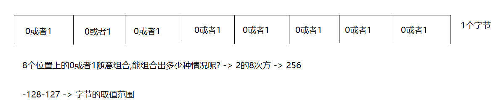
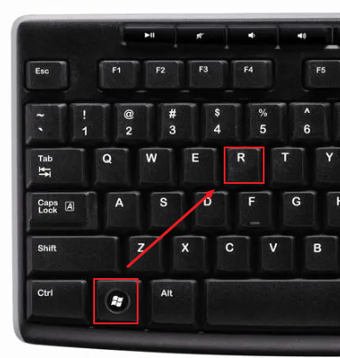
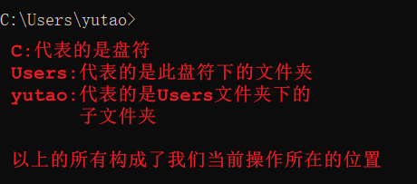
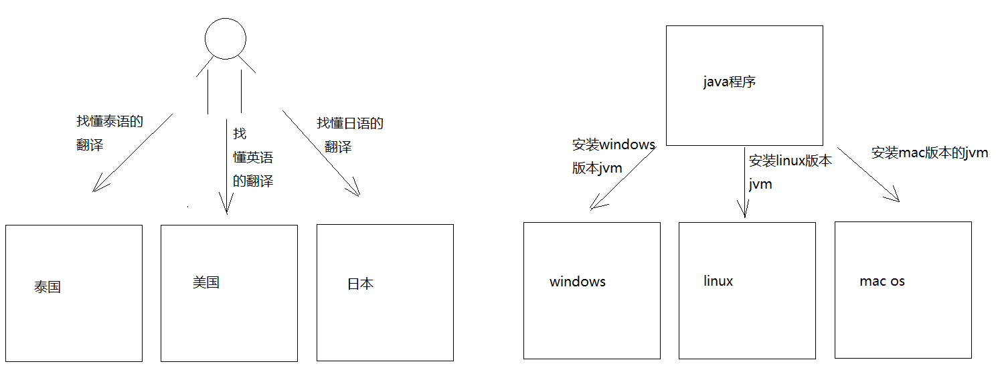
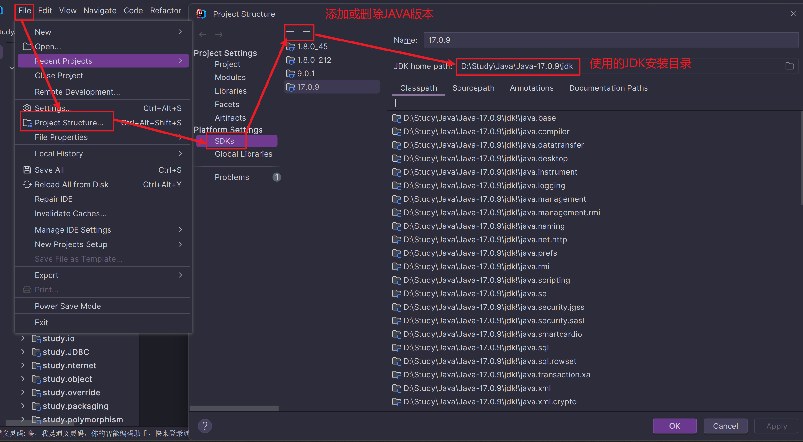
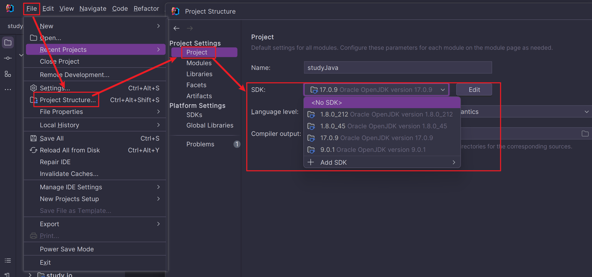

# 字节

> 1.字节:计算机中存储数据的最小存储单元(计量单位)，用byte或者B表示
>
> 二进制位：用bit(比特)表示
>
> 8个二进制位代表一个字节
>
> ---
>
>  2.存储单元之间的转换：
>
> 8bit = 1B
>
> 1024B = 1KB
>
> 1024KB = 1MB
>
> 1024MB = 1GB
>
> 1024GB = 1TB
>
> PB   EB  ZB ...    

# 常用的dos命令

> 打开dos命令窗口：
>
> win+r -> 输入cmd -> 回车

## 常用命令

| 作用                           | 命令                                                         |
| ------------------------------ | ------------------------------------------------------------ |
| 切换盘符                       | 盘符名: -> 回车 盘符名不区分大小写，但是计算机上必须有指定的盘符 |
| 查看当前路径下的文件或者文件夹 | dir                                                          |
| 进入到指定文件夹下             | cd 文件夹名字                                                |
| 进入到多级文件夹下             | cd 文件夹名字\文件夹名字                                     |
| 退到上一级目录                 | cd..或者 cd ..                                               |
| 直接退到磁盘位置(退到根目录)   | cd\或者cd \                                                  |
| 清屏                           | cls                                                          |
| 退出黑窗口                     | exit                                                         |
| 创建文件夹                     | mkdir 文件夹名                                               |
| 创建多级文件夹                 | mkdir 文件夹名\文件夹名                                      |
| 删除文件夹                     | rd 文件夹名 注意:删除的文件夹必须是空的 不走回收站     |
| 删除文件                       | del 文件名.后缀名 不走回收站                              |
| 批量删除文件                   | del *.后缀名                                                 |

**注意**

> 1.如何区分正斜杠和反斜杠:
>
> `/`：正斜杠
>
> `\`：反斜杠
>
> ---
>
> 2.快速打开该目录对应的dos命令窗口:
>
> a.选中路径
>
> b.输入cmd -> 回车
>
> ---
>
> 3.按上下箭头，切换之前输入过的命令
>
> ---
>
> 4.在dos命令窗口中，可以输入文件夹名或者文件名的一部分，按 -> tab键 -> 自动补全文件夹名或者文件名

# JVM

JVM是Java运行程序的虚拟机，主要用于运行Java程序。

Java想要跨平台，在Windows、Linu、Mac OS等系统上运行，就需要安装不同版本的JVM

# JDK和JRE

## JDK

JDK(Java Development Kit)：java开发工具包，包含了JRE

javac 编译工具

java 运行工具

jdb  调试工具

jhat 内存分析工具

……

## JRE

JRE(Java Runtime Environment)：Java运行环境，包含了jvm以及后面开发用到的核心类库

## 关联关系

JDK包含了JRE，JRE包含了jvm，所以我们只需要安装JDK即可

> JDK9版本以前，有一个单独的JRE目录。但是从JDK9开始，JDK目录中就没有单独的JRE目录了，因为JRE作为一个运行时，里面不需要包含太多的东西浪费空间，降低运行效率，在JDK9的时候引用模块化的技术，让开发者能按照自己的应用创建一个最小的运行时（比如一个微服务的部署应用仅仅需要一个非常小的runtime，而不是像以前一样不管应用复杂还是简单，都需要一个近百兆的JRE运行）这样提高了运行效率

## 环境变量配置

建议在系统环境变量中新增`JAVA_HOME`变量，值为JDK的安装目录

在Path变量中，新增一条值为`%JAVA_HOME%\bin`

**注意**

1. 如要更换JAVA版本，直接对`JAVA_HOME`变量修改，换成要用的JDK版本即可

2. 更换JDK版本后，若想要生效，请在Path变量中，将`%JAVA_HOME%\bin`移动到第一行

3. IDEA可以为项目单独设置JAVA版本，与系统环境变量中配置的版本无关

    

    

# 字符编码

在Java中处理文本时，字符编码是一个非常重要的概念。不同的字符编码方式决定了如何将计算机中的二进制数据解释为人类可读的文字。下面将详细介绍GBK和UTF-8这两种字符编码的区别。

## GBK 编码

GBK（GB2312扩展集）是GB2312标准的扩展，支持简体中文字符，同时也包含了繁体中文、日文、韩文等其他东亚语言的字符。GBK是一个双字节编码方案，这意味着大多数中文字符都使用两个字节来表示。对于ASCII字符（即英文和其他一些符号），GBK与ASCII兼容，也就是说ASCII字符在GBK中占用一个字节。

## UTF-8 编码

UTF-8（Unicode Transformation Format-8 bits）是一种可变长度的编码格式，它可以表示Unicode标准中的所有字符。UTF-8的设计目的是为了与ASCII兼容，因此所有ASCII字符在UTF-8编码下都是单个字节表示。对于非ASCII字符，UTF-8使用两到四个字节来编码

## GBK 和 UTF-8 的主要区别：

1. **字符集大小**：
   - GBK仅支持一部分东亚语言字符
   - UTF-8支持全球几乎所有的语言字符，包括GBK中的字符

2. **编码长度**：
   - GBK中，除了ASCII字符以外的所有字符都是用两个字节表示
   - UTF-8中，ASCII字符仍然是单字节，而其他字符则根据其所在Unicode范围的不同，可以是1到4个字节

3. **国际化支持**：
   - GBK主要针对的是中文环境，并不支持太多的国际化需求
   - UTF-8由于其设计特性，非常适合用于国际化的Web应用或者软件开发

4. **向后兼容性**：
   - GBK对GB2312是向下兼容的，但是并不支持其他非汉字字符
   - UTF-8与ASCII兼容，可以看作是ASCII的超集

5. **性能**：
   - 对于纯英文或以ASCII为主的文本，UTF-8更节省空间
   - 对于全中文文本，GBK可能更紧凑，但考虑到UTF-8的通用性，现在普遍推荐使用UTF-8

在Java编程中，处理字符串时应尽量使用UTF-8编码，因为它更具有普遍性和兼容性。如果你需要读取或写入使用GBK编码的文件，则需要显式地指定编码方式，例如使用`InputStreamReader`或`OutputStreamWriter`时指定“GBK”作为参数。不过，在现代的应用程序开发中，建议尽可能使用UTF-8编码，以确保文本处理的一致性和兼容性