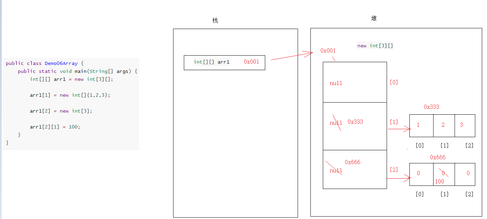

# 内存

内存：可以理解“内存条”，任何程序，软件运行起来都会在内存中运行，占用内存，在Java的世界中，将内存分为了5大块

## 栈(重点)(Stack)

主要运行方法，方法的运行都会去栈内存中运行，运行完毕之后，需要“弹栈”，腾空间

## 堆(重点)(Heap)

每new一次，都会在堆内存中开辟空间，并为此空间自动分配一个地址值
堆中的数据都是有默认值的：

- 整数:0
- 小数:0.0
- 字符:'\u0000'
- 布尔:false
- 引用:null    

## 方法区(重点)(Method Area)

代码的“预备区”，记录了类的信息以及方法的信息

## 本地方法栈(了解)专门运行native方法(本地方法)

本地方法可以理解为对java功能的扩充，有很多功能java语言实现不了，所以就需要依靠本地方法完成

## 寄存器(了解) -> 跟CPU有关

## Java类的运行逻辑图


## 案例

### 一个数组的内存图

定义一个 [一维数组](40.数组.md#一维数组)，如下为内存图


### 两个数组的内存图

创建了两个数组，在堆内存中开辟了两个不同的空间，此时修改一个数组中的元素不会影响到另外一个数组中的数据


### 两个数组指向同一片内存空间

arr2不是new出来的，是arr1直接赋值的，arr1在内存中保存的是地址值，给了arr2，那么arr2的地址值和arr1就是一样的
所以此时arr1和arr2指向了堆内存中的同一片空间（同一个地址值，同一个数组），此时改变一个数组中的元素会影响到另外一个数组


### 二维数组的内存图

定义一个 [二维数组](40.数组.md#二维数组)，如下为内存图

```java
public class Demo06Array {
    public static void main(String[] args) {
        int[][] arr1 = new int[3][];

        arr1[1] = new int[]{1,2,3};

        arr1[2] = new int[3];

        arr1[2][1] = 100;
    }
}
```



### 一个对象的内存图

定义一个 [对象](../20.Java面向对象/5.类和对象.md#对象)，如下是其内存图


### 两个对象的内存图

定义两个对象，如下是其内存图


### 两个对象指向同一片内存空间

phone2是phone1给的，phone1在内存中保存的是地址值，此时phone1和phone2地址值是一样的了，操作的是同一片空间的数据，所以改变一个对象的数据会影响到另外一个对象

