# 方法介绍

每个独立运行的程序都需要有一个main方法，但是所有的代码都放在main方法中，会显得main方法代码太多、太乱、太臃肿，从而导致不好维护。对此，我们可以将不同功能的代码放到不同的方法中，想执行某个功能，直接调用方法名就行了，对应的代码就自动执行起来了，将来维护的时候，直接找到对应的方法，就可以对其直接修改维护

方法：拥有功能性代码的代码块。将不同的功能放在不同的方法中，给每个方法取个名字，直接调用方法名，对应的方法就执行起来了，好维护

基本语法：

```java
修饰符 返回值类型 方法名(参数){
    方法体
    return 结果;
}
```

修饰符：public、[private](25.封装.md#private)、protected、default

返回值类型：int、double等 [数据类型](../10.Java基础结构/20.常量、变量、标识符.md#数据类型)，无返回值类型为void

方法名的命名方式请参考：[Java命名规范](../other/Java命名规范.md#Java方法名与对象名（变量名）)

参数：进入到方法内部参与执行的数据（数据类型 变量名,数据类型 变量名）

方法体：实现该方法的具体代码

根据方法的基本语法的定义写法，分有四类：

1. 无参无返回值方法
2. 有参无返回值方法
3. 无参有返回值方法
4. 有参有返回值方法

## 注意

1. 返回值用return返回，返回值类型为void代表无返回值
2. 写了void后，可以用return结束方法，但是不能用return返回结果
3. 方法不调用不执行，main方法由jvm调用
4. 方法之间不能互相嵌套，方法之间是平级的
5. 方法的执行顺序只和调用顺序有关
5. 一个方法中不能连续写多个return（也就是说一个方法不能都多个返回值）

## 无参无返回值

案例：

```java
public class Demo01Method {
    public static void main(String[] args) {
        farmer();
        cook();
        me();
        cook();
    }

    //农民伯伯
    public static void farmer(){
        System.out.println("播种");
        System.out.println("施肥");
        System.out.println("拔草");
        System.out.println("浇水");
        System.out.println("除虫");
        System.out.println("收割");
    }

    //厨师
    public static void cook(){
        System.out.println("洗菜");
        System.out.println("切菜");
        System.out.println("炒菜");
        System.out.println("装盘");
        System.out.println("上菜");
    }

    //我们自己
    public static void me(){
        System.out.println("洗手");
        System.out.println("吃菜");
    }
}
```

执行流程：

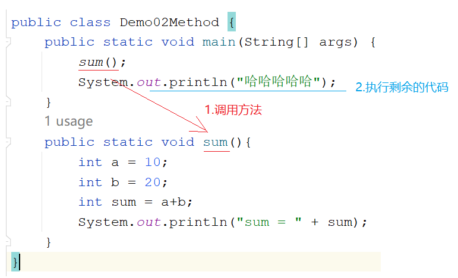

## 有参无返回值

案例：

```java
public class Demo03Method {
    public static void main(String[] args) {
       sum(10,20);
    }

    public static void sum(int a,int b){
        int sum = a+b;
        System.out.println("sum = " + sum);
    }
}
```

执行流程：

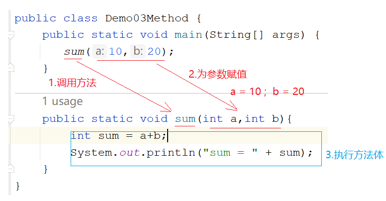

## 无参有返回值

案例：

```java
public class Demo04Method {
    public static void main(String[] args) {
        //打印调用 -> 涛哥不推荐
        System.out.println(sum());

        //赋值调用-> 极力推荐
        int result = sum();
        System.out.println("result = " + result);

    }

    public static int sum(){
        int a = 10;
        int b = 20;
        int sum = a+b;
        return sum;
        //return a+b;
    }
}
```

执行流程：

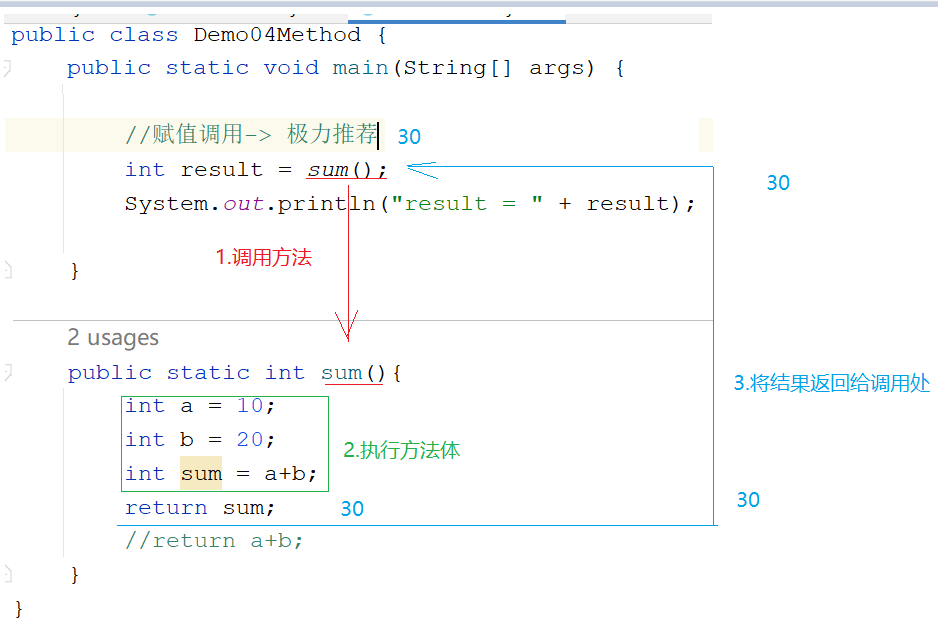

## 有参有返回值

案例：

```java
public class Demo05Method {
    public static void main(String[] args) {
        int sum = sum(10, 20);
        System.out.println("sum = " + sum);
    }
    public static int sum(int a,int b){
        int sum = a+b;
        return sum;
    }
}
```

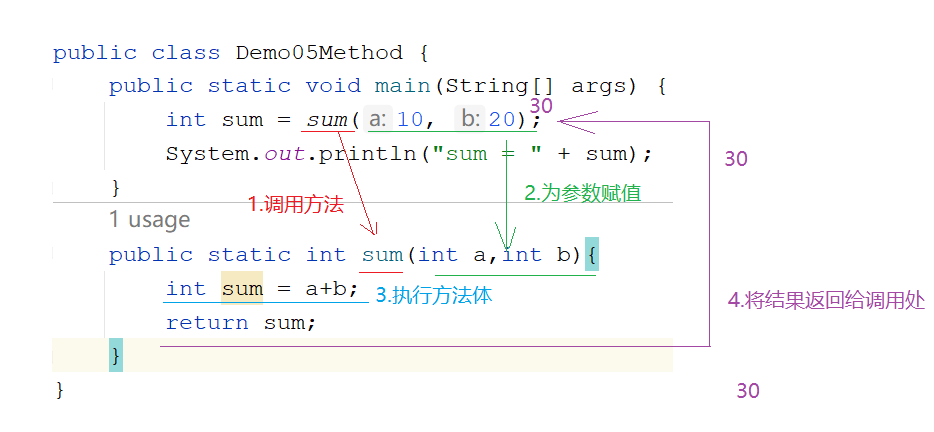

## 参数和返回值使用的时机

参数：当想将方法A的数据传递到方法B时，那么定义方法B时就需要带个参数，在方法A中调用方法B时，可以将方法A中的数据通过参数传递到方法B中

返回值：调用方法A时，想要方法A的结果，去参与其他的操作，那么方法A就需要将自己的结果返回

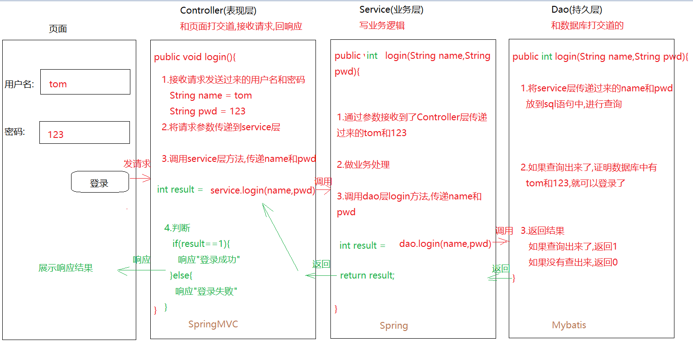

# 参数

## 形参和实参的区别

1. 形式参数（形参）：在定义方法的时候形式上定义的参数，此参数还没有值
2. 实际参数（实参）：在调用方法的时候给形参赋予的具体的值

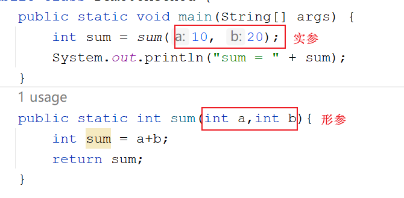

## 变量作为实参使用

```java
public class Demo07Method {
    public static void main(String[] args) {
        int i = 10;
        int j = 20;
        //传递的是i和j，但是我们真正传递的是i和j代表的数据，不是变量本身
        boolean result = compare(i, j);
        System.out.println("result = " + result);
    }
    /*
    定义一个方法，比较两个整数的大小，如果第一个比第二个大，返回true，否则返回false
    */
    public static boolean compare(int a,int b){
        if (a>b){
            return true;
        }else{
            return false;
        }
    }
}
```

### 基本数据类型做方法参数传递

基本数据类型做方法参数传递，传递的是值，不是变量本身

方法运行：压栈

方法运行完毕：弹栈 => 释放栈内存

案例：

```java
public class Demo01Param {
    public static void main(String[] args) {
        int a = 10;
        int b = 20;
        method(a,b);
        System.out.println(a);//10
        System.out.println(b);//20
    }
    public static void method(int a,int b){
        a+=10;
        b+=20;
        System.out.println(a);//20
        System.out.println(b);//40
    }
}
```

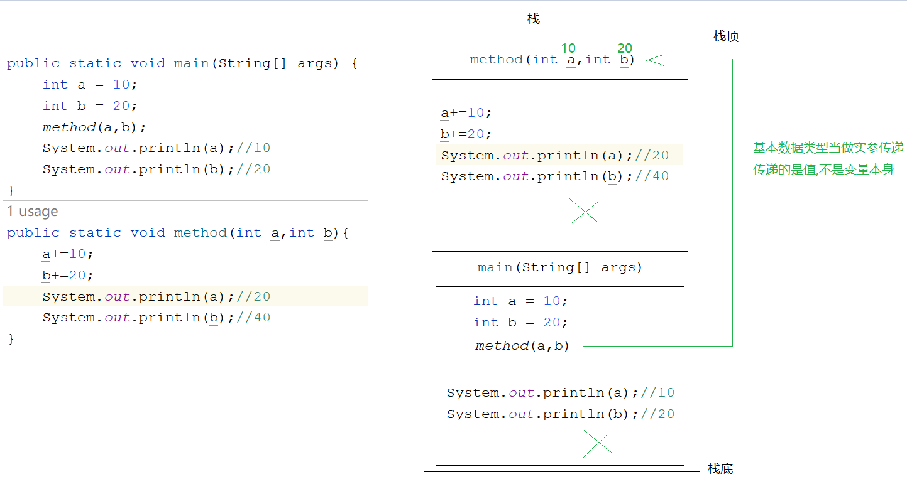

### 引用数据类型做防范参数传递

引用数据类型做方法参数传递时，传递的是地址值

案例：

```java
public class Demo02Param {
    public static void main(String[] args) {
        int[] arr = {10,20};
        method(arr);
        System.out.println(arr[0]);//20
        System.out.println(arr[1]);//40
    }

    public static void method(int[] arr){
        arr[0]+=10;
        arr[1]+=20;
        System.out.println(arr[0]);//20
        System.out.println(arr[1]);//40
    }
}
```

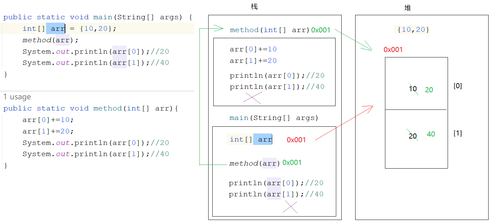

## 可变参数

基本语法：

```java
修饰符 返回值类型 方法名(数据类型... 变量名){
    方法体
    return 结果;
}
```

**注意**：

1. 可变参数在只明确参数类型，不明确参数个数时使用
2. 可变参数本质上是一个数组
3. 参数位置不能连续写多个可变参数，而且当可变参数和其他普通参数一起使用时，可变参数需要放到参数列表最后

案例：

```java
public class Demo01Var {
    public static void main(String[] args) {
        sum(1,2,3,4,5);
        sum1(1,1,2,3,4);
    }

    public static void sum(int...arr){
        int sum = 0;
        for (int i = 0; i < arr.length; i++) {
            sum+=arr[i];
        }
        System.out.println(sum);
    }
    
    public static void sum1(int i,int...arr){
        
    }
    
}
```

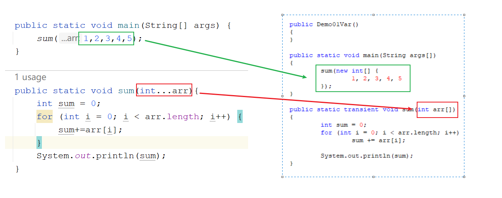

案例：n个字符串进行拼接，每一个字符串之间使用某字符进行分隔，如果没有传入字符串，那么返回空字符串""

```java
public class Demo03Var {
    public static void main(String[] args) {
        String result = concat("-", "张三丰", "张翠山", "张无忌");
        System.out.println("result = " + result);
    }

    public static String concat(String regex, String... s) {
        String str = "";
        for (int i = 0; i < s.length; i++) {
            if (i == s.length - 1) {
                str += s[i];
            } else {
                str += s[i] + regex;
            }
        }

        return str;
    }
}
```

## 命令行参数

通过命令行给main方法的形参传递的实参称为命令行参数

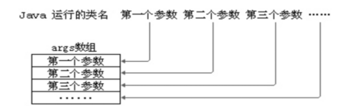

案例：

```java
public class TestCommandParam{
	//形参：String[] args
	public static void main(String[] args){
		for(int i=0; i<args.length; i++){
			System.out.println("第" + (i+1) + "个参数的值是：" + args[i]);
		}
	}
}
```

运行命令

```command
java TestCommandParam
java TestCommandParam 1 2 3
java TestCommandParam hello atguigu
```

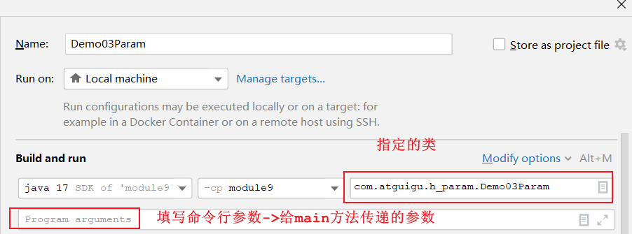

# 方法重载（Overload）

重载：方法名相同，参数列表不同的方法

什么叫参数列表不同：

1. 参数个数不同
2. 参数类型不同
3. 参数类型顺序不同

判断两个方法是否为重载方法，和什么无关：

1. 和参数名无关
2. 和返回值无关

如果定义方法功能一样，只不过实现细节不一样，就可以考虑定义成重载的方法

案例：

```java
/*
定义三个方法，分别求2个整数相加，3个整数相加，4个整数相加
*/
public class Demo1OverLoad {
    public static void main(String[] args) {
        sum(10,20);
        sum(10,20,30);
        sum(10,20,30,40);
    }

    //两个整数相加
    public static void sum(int a,int b){
        System.out.println(a+b);
    }

    //三个整数相加
    public static void sum(int a,int b,int c){
        System.out.println(a+b+c);
    }

    //四个整数相加
    public static void sum(int a,int b,int c,int d){
        System.out.println(a+b+c+d);
    }
}
```

