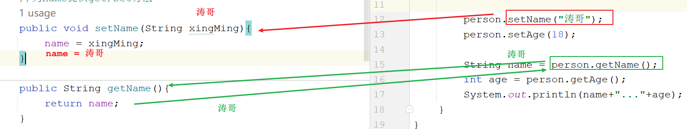
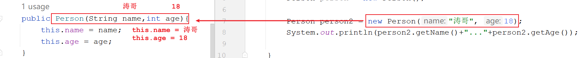
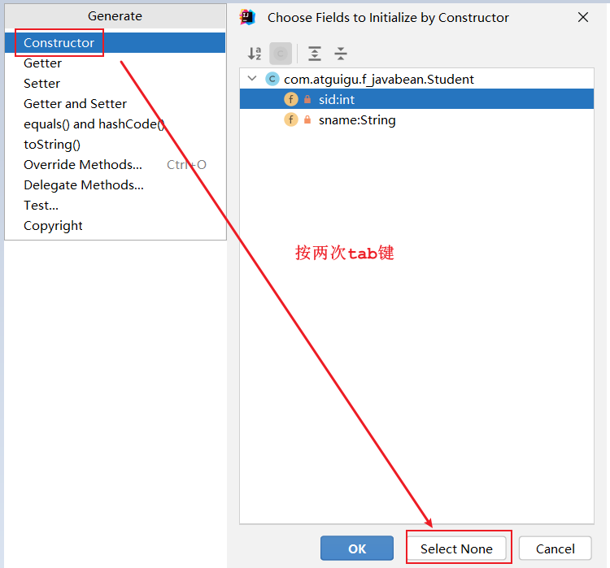
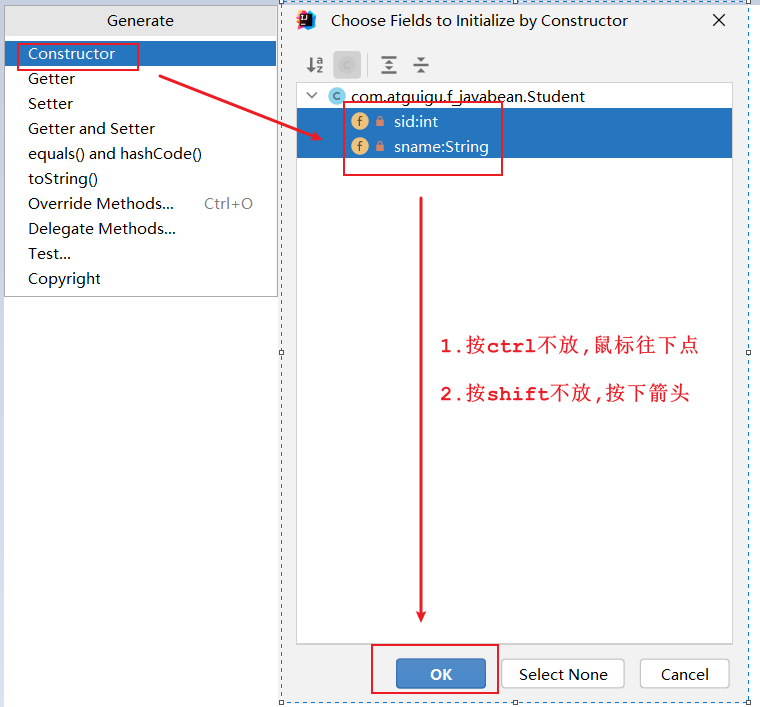
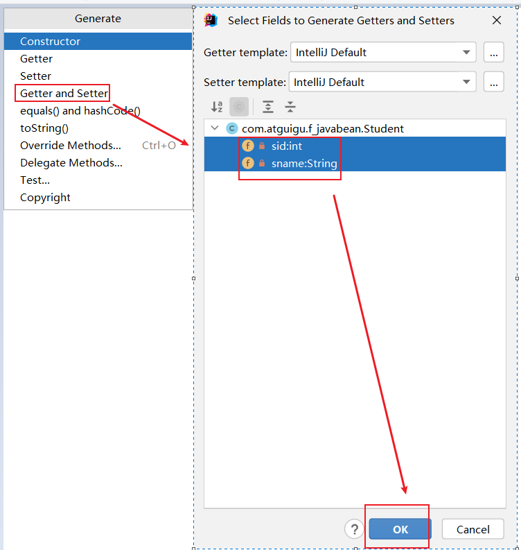
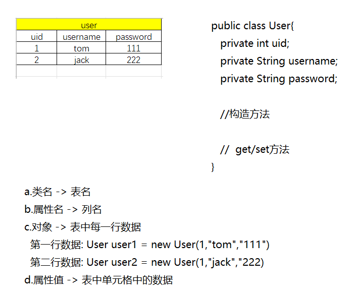
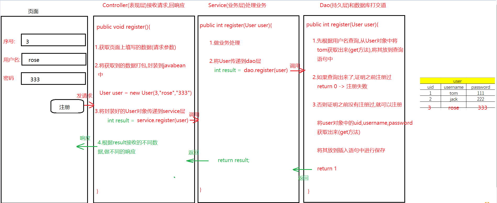
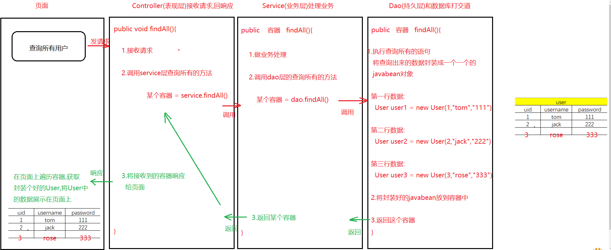

# 封装思想

封装是面向对象的三大特性之一，意为将一个物品封装起来，外界不能直接使用了，提高了物品的安全性

> 什么是封装思想：
>
> 以洗衣机为例，洗衣机的浸泡、定时、洗涤、甩干、烘干等功能可以视作“洗衣机”这个抽象类的方法，在大多数时候，使用者无需关心这些方法的内部逻辑，只需要知道如何调用这些方法即可
>
> 即洗衣机的细节功能被隐藏起来，对外提供了公共的接口（按钮），通过这些接口（按钮）就能够使用洗衣机的各项功能
>
> 洗衣机内部是复杂的，对外展示的功能按钮则是简单的。隐藏对象内部的复杂性，只对外提供公开，公共的接口，便于外界调用，从而==提高了系统的可扩展性、可维护性、安全性==，这就是**封装思想**
>
> 把细节隐藏起来，不让外界随意使用，但是可以提供一个公共的接口让外界间接使用隐藏起来的细节=>封装思想

## private

[private（私有）](22.权限修饰符.md#private（私有）)：被`private`修饰的 [成员变量](10.成员变量.md)、[方法](15.方法.md) 只能够在本类中使用，在其他类中无法使用。这么一来，即时是在其他类中`new`出了该类的对象，也不能调用被`private`修饰的成员变量或方法

基本语法：

```java
private 返回值类型 方法名(参数){
    方法体
    return 结果;
}
private 数据类型 变量名;
```

注意：将代码放到一个方法中，也是封装的体现。一个成员使用`private`修饰也是封装的体现

## 公共接口（成员属性）

用`private`修饰的成员属性被私有化后，外界是无法直接调用的，此时需要为这些成员属性提供公共的接口，即`get/set`方法

`get`方法：获取属性值

`set`方法：为属性赋值

案例：

```java
public class Person {
    private String name;
    private int age;

    //为name提供get/set方法
    public void setName(String xingMing) {
        name = xingMing;
    }

    public String getName() {
        return name;
    }

    //为age提供get/set方法
    public void setAge(int nianLing) {
        if (nianLing < 0 || nianLing > 150) {
            System.out.println("你脑子是不是秀逗啦!岁数不合理");
        } else {
            age = nianLing;
        }
    }

    public int getAge() {
        return age;
    }
}
//-----------------分割--------------------------------
public class Test01 {
    public static void main(String[] args) {
        Person person = new Person();
        //person.name = "涛哥";
        //person.age = -18;

        //System.out.println(person.name);
        //System.out.println(person.age);

        person.setName("涛哥");
        person.setAge(18);

        String name = person.getName();
        int age = person.getAge();
        System.out.println(name+"..."+age);
    }
}
```



## this

在`Java`中，`this`关键字是一个引用变量，它指向当前对象

**注意**：

- 构造器调用：==`this` 调用必须是构造器中的第一条语句==
- 静态上下文：==`this` 不能在静态上下文中使用==，因为 `this` 是与对象实例相关的，而静态方法和静态变量属于类本身
- 继承：在子类中，`this` 引用的是子类的对象，而不是父类的对象。如果需要访问父类的方法或成员变量，应使用 `super`

### 区分参数与成员变量

当方法的参数或局部变量与类中的成员变量同名时，可以使用`this`关键字来区分它们

```java
public class Person {
    private String name;

    public void setName(String name) {
        this.name = name; // this.name 指向的是成员变量，name 是方法的参数
    }
}
```

### 调用当前对象的方法

`this`也可以用来调用当前对象的其他方法。虽然通常可以直接调用这些方法而不需要使用`this`，但在某些情况下，使用`this`可以使代码更加清晰

```java
public class Car {
    public void start() {
        System.out.println("Car is starting.");
    }

    public void drive() {
        this.start(); // 调用当前对象的start方法
        System.out.println("Car is driving.");
    }
}
```

### 调用构造函数

`this`可以用于一个构造函数内部来调用同一个类中的另一个构造函数。==这种用法必须放在构造函数的第一行==，故而`this()`和`super()`不能同时出现

```java
public class Employee {
    private String firstName;
    private String lastName;

    public Employee() {
	    // 调用带两个参数的构造函数
        this("John", "Doe"); 
    }

    public Employee(String firstName, String lastName) {
        this.firstName = firstName;
        this.lastName = lastName;
    }
}
```

### 传递当前对象作为参数

在调用方法时，可以将`this`作为参数传递给其他方法，表示将当前对象自身作为一个参数传入

```java
public class NetworkNode {
    private String id;

    public NetworkNode(String id) {
        this.id = id;
    }

    public void connectTo(NetworkNode otherNode) {
        otherNode.connect(this); // 将当前对象作为参数传递给otherNode的connect方法
    }

    private void connect(NetworkNode node) {
        System.out.println("Connecting " + this.id + " to " + node.id);
    }
}
```

### 返回当前对象

在一些方法中，可能需要返回当前对象本身，比如在构建链式调用（fluent interfaces）时

```java
public class Settings {
    private boolean setting1;
    private boolean setting2;

    public Settings setSetting1(boolean setting1) {
        this.setting1 = setting1;
        return this; // 返回当前对象，允许连续调用
    }

    public Settings setSetting2(boolean setting2) {
        this.setting2 = setting2;
        return this;
    }
}
```

## 构造方法

构造方法：构造方法是一种特殊的方法，它用于初始化新建的对象。构造方法的名字必须与类名完全相同，并且没有返回类型，即使是`void`也不行。当使用`new`关键字创建一个类的实例时，构造方法会被自动调用。

**特点**

1. 名称：构造方法的名称必须与类名一致
2. 无返回类型：构造方法不返回任何值，也不能声明为`void`
3. 自动调用：当一个对象被创建时，构造方法会自动执行
4. 主要任务：用于初始化对象的状态，即设置成员变量的初始值

**种类**

1. 默认构造方法：如果一个类没有定义任何构造方法，那么Java编译器会自动提供一个默认的构造方法，这个构造方法是无参的，并且不做任何事
2. 参数化构造方法：允许你在创建对象的时候传递参数的构造方法，这样可以在创建对象的同时就对对象的状态进行初始化

案例

```java
public class Person {
    private String name;
    private int age;

    //无参构造
    public Person(){
        System.out.println("我是无参构造");
    }

    //有参构造
    public Person(String name,int age){
        this.name = name;
        this.age = age;
    }

    public void setName(String name) {
        this.name = name;
    }

    public String getName() {
        return name;
    }

    public void setAge(int age) {
        this.age = age;
    }

    public int getAge() {
        return age;
    }
}
//-----------------分割--------------------------------
public class Test01 {
    public static void main(String[] args) {
        Person person = new Person();

        Person person2 = new Person("涛哥", 18);
        System.out.println(person2.getName()+"..."+person2.getAge());

    }
}
```



## 标准`JavaBean`

`JavaBean`是`Java`语言编写类的一种标准规范通常用于封装数据（属性）以及对这些数据进行操作的方法（行为）。`JavaBean`的设计目的是为了方便组件开发，特别是在企业级应用中，如`JavaServer Pages(JSP)`和`Servlets`中作为数据载体（`DataBase`）

符合`JavaBean`的类，**要求**

1. 类必须是具体的（非抽象`abstract`）和公共的，`public class 类名`
2. 并且具有无参数的构造方法，有参构造
3. 成员变量私有化，并提供用来操作成员变量的`set` 和`get` 方法

**特点**

1. 封装性：`JavaBean`应该具有封装的数据字段，通常通过私有访问权限来实现
2. 公共访问器和修改器方法：对于每个数据字段，应该有一个公共的`getter`方法和`setter`方法来访问和设置其值
3. 无状态或可序列化：`JavaBean`通常是没有状态的（`stateless`），这意味着它们不会保存任何状态信息，如果有状态信息，`JavaBean`通常需要实现`Serializable`接口，以便可以将它们的状态保存到持久存储中或在网络上传输
4. 构造方法：`JavaBean`可以有构造方法，但通常至少需要一个无参数的构造方法
5. 遵循命名约定：属性名通常是小写的，而方法名则遵循特定的 [命名规则](../other/Java命名规范.md)

案例

```java
public class Person {
    private String name;
    private int age;

    //无参构造
    public Person(){
        
    }

    //有参构造
    public Person(String name,int age){
        this.name = name;
        this.age = age;
    }

    public void setName(String name) {
        this.name = name;
    }

    public String getName() {
        return name;
    }

    public void setAge(int age) {
        this.age = age;
    }

    public int getAge() {
        return age;
    }
}
```

**快捷生成`JavaBean`**

1. 生成无参构造

    

2. 生成有参构造

    

3. 生成get/set方法

    

### `JavaBean`怎么来的

将来的`JavaBean`都是和数据库的表相关联

1. 类名 => 表名
2. 属性名 => 列名
3. 对象 => 表中每一行数据
4. 属性值 => 表中单元格中的数据





将页面填写的数据获取到,封装到`JavaBean`中，一层一层传递到`dao`层，然后将`JavaBean`中的属性值获取出来放到表中保存 => 相等于是一个添加功能



将所有的数据查询出来,封装成一个一个的`JavaBean`对象，然后将封装好的`JavaBean`对象放到一个容器中，将此容器返回 给页面，在页面上遍历展示
