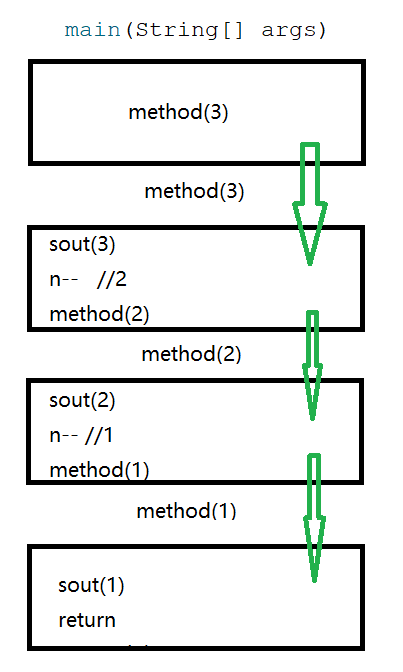

# 递归

递归：方法内部自己调用自己

分类：

直接递归

```java
public static void method(){
    method();
}
```

间接递归

```java
public static void method1(){
    method2();
}
public static void method2(){
    method3();
}
public static void method3(){
    method1();
}
```

**注意**：

1. ==递归必须要有出口==，否则会出现“**栈内存溢出**”
2. 递归即使有出口，也尽量不要递归太多次数

案例：利用递归输出3到1

```java
public class Demo02Recursion {
    public static void main(String[] args) {
        method(3);
    }

    public static void method(int n){
        if (n==1){
            System.out.println(n);
            //结束方法
            return;
        }
        System.out.println(n);
        n--;
        method(n);
    }
}
```

