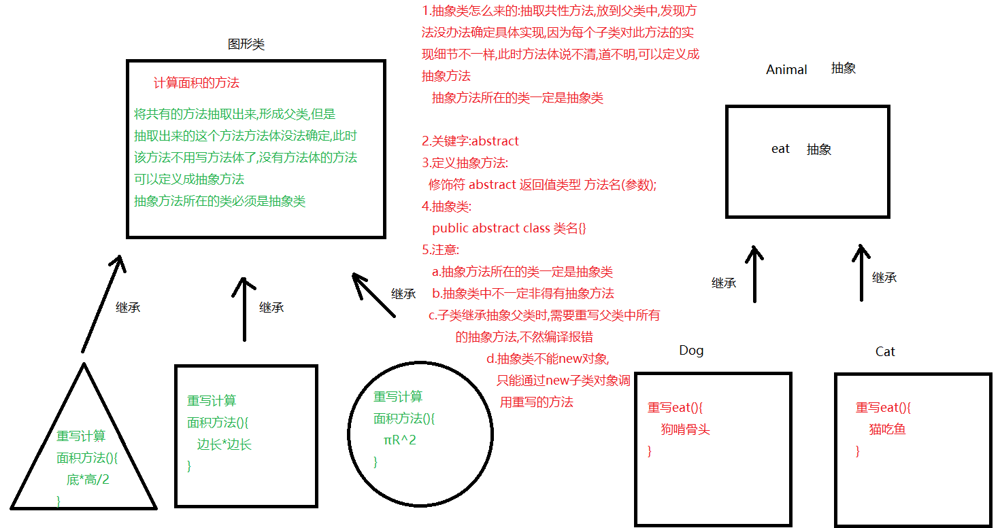
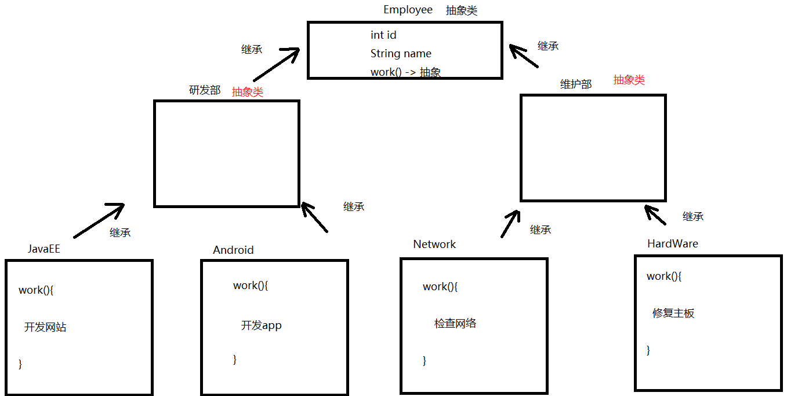

# 抽象

抽象是一种重要的面向对象编程概念，用于表示不完整或部分实现的类和方法。抽象类和抽象方法允许你定义一个类的骨架，而不必完全实现所有方法。这有助于创建一个通用的接口，同时让子类提供具体的实现，这种机制有助于隐藏复杂的实现细节，同时提供清晰简洁的接口给用户使用



**使用抽象类和抽象方法的好处**

1. 强制子类实现特定的行为：通过定义抽象方法，可以确保所有继承抽象类的子类都必须实现这些方法，从而保证子类具有一致的行为
2. 提高代码的灵活性和扩展性：抽象方法提供了一个通用的接口，使得子类可以根据具体需求实现不同的功能，提高了代码的灵活性和可扩展性
3. 代码服用：抽象类可以包含具体方法，这些方法可以在子类中复用，减少了代码重复

## Abstract

`Abstract`关键字用于定义抽象类或抽象方法

### 抽象类

抽象类：抽象类是用`abstract`关键字修饰的类。它可以包含抽象方法（没有方法体的方法）和具体方法（有方法体的方法）。如果一个类包含至少一个抽象方法，则该类必须声明为抽象类

**基本语法**

```java
public abstract class 类名{}
```

**特点**

1. ==抽象类不能被实例化==，即不能创建抽象类的对象，只能通过`new`子类对象调用重写方法
2. 子类继承抽象类时，==必须实现抽象类中的所有抽象方法==，除非子类也是抽象类
3. 抽象类可以包含成员变量、构造方法、静态方法等，就像普通类一样（即==抽象类不一定有抽象方法==）

用途：抽象类通常用于表示一组相关类的共同特性，提供了一种模板，定义了子类应该遵循的基本结构

### 抽象方法

抽象方法：一种没有具体实现（即没有方法体）的方法。抽象方法必须定义在抽象类或接口中。当一个类包含一个或多个抽象方法时，这个类也必须声明为抽象类。抽象方法的主要目的是为了提供一个通用的方法签名，要求子类必须实现这些方法，以确保子类具有特定的行为

**基本语法**

```java
修饰符 abstract 返回值类型 方法名(参数);
```

**特点**

1. 抽象方法必须定义在抽象类中
2. 如果一个类包含一个或多个抽象方法，那么这个类必须声明为抽象类
3. 继承抽象类的子类必须实现所有抽象方法，除非子类本身也是抽象类
4. 抽象方法没有方法体，即没有大括号 `{}` 和方法体内的代码
5. 抽象方法的声明以分号 `;` 结束

### 案例

> 某IT公司有多名员工，按照员工负责的工作不同，进行了部门的划分（研发部、维护部）
> 研发部(Developer)根据所需研发的内容不同，又分为 JavaEE工程师 、Android工程师 
> 维护部(Maintainer)根据所需维护的内容不同，又分为 网络维护工程师(Network) 、硬件维护工程师(Hardware) 
>
> 公司的每名员工都有他们自己的员工编号、姓名，并要做它们所负责的工作
>
> 工作内容
>
> - JavaEE工程师： 员工号为xxx的 xxx员工，正在研发电商网站
> - Android工程师：员工号为xxx的 xxx员工，正在研发电商的手机客户端软件
> - 网络维护工程师：员工号为xxx的 xxx员工，正在检查网络是否畅通
> - 硬件维护工程师：员工号为xxx的 xxx员工，正在修复电脑主板
>
> 请根据描述，完成员工体系中所有类的定义，并指定类之间的继承关系。进行XX工程师类的对象创建，完成工作方法的调用
>
> 

```java
public abstract class Employee {
    private int id;
    private String name;

    public Employee() {
    }

    public Employee(int id, String name) {
        this.id = id;
        this.name = name;
    }

    public int getId() {
        return id;
    }

    public void setId(int id) {
        this.id = id;
    }

    public String getName() {
        return name;
    }

    public void setName(String name) {
        this.name = name;
    }

    //抽象方法
    public abstract void work();
}
//-----------------分割--------------------------------
public abstract class Developer extends Employee{
}
//-----------------分割--------------------------------
public class JavaEE extends Developer{
    @Override
    public void work() {
        //System.out.println("员工号为:"+getId()+"的"+getName()+"正在开发网站");
        System.out.println("员工号为:"+this.getId()+"的"+this.getName()+"正在开发网站");
    }
}
//-----------------分割--------------------------------
public class Android extends Developer{
    @Override
    public void work() {
        //System.out.println("员工号为:"+getId()+"的"+getName()+"正在开发app");
        System.out.println("员工号为:"+this.getId()+"的"+this.getName()+"正在开发app");
    }
}
//-----------------分割--------------------------------
public class Test01 {
    public static void main(String[] args) {
        JavaEE javaEE = new JavaEE();
        javaEE.setId(1);
        javaEE.setName("涛哥");
        javaEE.work();
        System.out.println("===============");
        Android android = new Android();
        android.setId(2);
        android.setName("金莲");
        android.work();
    }
}
```

