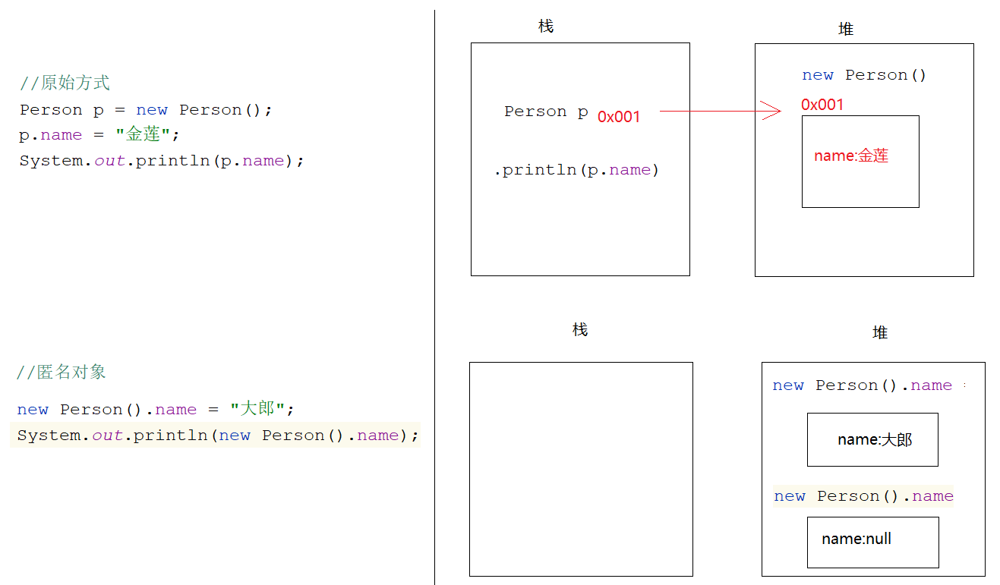

# 面向对象介绍

面向过程：自己的事情自己干，代表语言C语言。例如洗衣服，每一步自己要亲力亲为 => 找个盆，放点水，找个搓衣板，搓搓搓

面向对象：自己的事情别人帮忙去干，代表语言Java语言。例如洗衣服，自己的事情别人干 => 全自动洗衣机

案例：

```java
public class Demo01Object {
    public static void main(String[] args) {
        /*
           我们想在Demo01Object类中使用Scanner类中的next方法实现录入字符串
           那么我们就需要使用面向对象思想编程

           对象:Scanner -> new出来的
           对象实现好的功能:next()

           我们只需要知道找来Scanner这个对象,就可以调用这个对象中实现好的next方法
           至于next方法怎么实现的,我们不需要关心
         */
        Scanner sc = new Scanner(System.in);
        String data = sc.next();
        System.out.println("data = " + data);

        System.out.println("===================================");

        /*
           我们想在Demo01Object类中使用Random类中的nextInt方法实现随机整数
           那么我们就需要使用面向对象思想编程

           对象:Random -> new出来的
           对象实现好的功能:nextInt()

           我们只需要知道找来Random这个对象,就可以调用Random中的nextInt方法
           至于nextInt怎么实现的,我们不需要关心
         */
        Random rd = new Random();
        int data2 = rd.nextInt();
        System.out.println("data2 = " + data2);

        System.out.println("====================================");

        int[] arr = {1,2,3,4};//[1,2,3,4]
       /* System.out.print("[");
        for (int i = 0; i < arr.length; i++) {
            if (i== arr.length-1){
                System.out.print(arr[i]+"]");
            }else{
                System.out.print(arr[i]+",");
            }
        }*/

        /*
           Arrays就是我们找来的对象
           toStrig就是此对象中实现好的功能
           我们只需要调用,怎么实现我们不关心
         */
        System.out.println(Arrays.toString(arr));

    }
}
```

# 类`/`对象

## 类（实体类）Class

实体类：是一类事物的抽象表示形式，世间万物的分类：比如: 人类、狗类、猫类、鼠标类

测试类：带main方法的类，主要是运行代码的

实体类的组成部分包含属性（[成员变量](10.成员变量.md)）与行为（成员方法）

案例：

```java
public class Animal {
 String kind;//品种
 String color;//颜色

 public void eat(){
     System.out.println("动物要吃饭");
 }

 public void sleep(){
     System.out.println("动物都睡觉");
 }

}
```

## 对象

概述：一类事物的具体体现

创建对象基本语法：

```java
类名 对象名 = new 类名() -> 比如: Person person = new Person();
```

如果两个类在同一个包下，创建对象是不需要导包的，如果两个类不在同一个包下，那么需要先导包才能创建对象（不然会报错）

特殊包：java.lang => 使用lang包下的类不需要导包 => String

**调用成员（成员变量、成员方法）**

```java
对象名.成员变量名 = 值
对象名.方法名() => 调用的是无参无返回值方法
对象名.方法名(实参) => 调用的是有参无返回值方法
数据类型 变量名 = 对象名.方法名() => 调用的是无参有返回值方法
数据类型 变量名 = 对象名.方法名(实参) => 调用的是有参有返回值方法
```

案例：

```java
public class Person {
    //属性-> 成员变量
    String name;
    int age;

    //行为 -> 成员方法
    public void eat(){
        System.out.println("人要干饭");
    }

    public void drink(){
        System.out.println("人要喝水");
    }
}
//-----------------分割--------------------------------
public class Demo01Person {
    public static void main(String[] args) {
        Person person = new Person();
        System.out.println(person.name);
        System.out.println(person.age);
        person.name = "金莲";
        person.age = 26;
        System.out.println(person.name);
        System.out.println(person.age);

        person.eat();
        person.drink();

    }
}
```

### 匿名对象

概述：其实就是没有等号左边的部分，只有等号右边的部分（对象）。即创建了对象，但是没有一个变量去接收它

基本语法：

```java
new 对象().成员
```

注意：如果只是想要单纯的调用该对象的方法，可以使用匿名对象。若涉及到了赋值，则不要使用匿名对象

案例：

```java
public class Person {
    String name;
    public void eat(){
        System.out.println("人要吃饭");
    }
}
//--------------------------------
public class Demo01Person {
    public static void main(String[] args) {
        //原始方式
        Person p = new Person();
        p.name = "金莲";
        System.out.println(p.name);
        p.eat();

        System.out.println("=================");

        //匿名对象
        new Person().eat();

        new Person().name = "大郎";
        System.out.println(new Person().name);//null
    }
}
```

