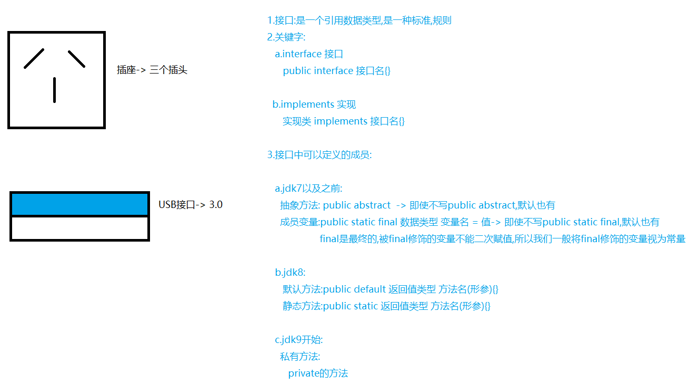

# 接口

接口（Interface）是一种定义行为规范的方式。接口允许你定义一组方法，但不需要提供这些方法的具体实现（类似 [抽象](45.抽象.md) ）。实现接口的类必须提供这些方法的具体实现。接口是实现 [多态](35.多态.md) 和代码重用的重要机制之一



**使用接口的好处**

1. **定义行为规范**
    - **明确职责**：接口定义了一组方法，这些方法描述了实现类应该具备的行为。这有助于开发者明确类的职责，确保类的行为符合预期
    - **解耦**：接口将行为与实现分离，使得类之间的依赖关系更加松散。这有助于降低系统的复杂性，提高模块化程度
2.  **实现多继承**
    - **多重行为**：Java不支持多继承（一个类不能继承多个类），但一个类可以实现多个接口。这使得类可以具备多种行为，而不会导致类层次结构的混乱
    - **灵活性**：通过实现多个接口，类可以轻松地组合多种行为，提高了代码的灵活性和可扩展性
3. **提高代码的可维护性和可扩展性**
    - **易于修改**：接口的变化不会影响已经实现接口的类，只要接口的方法签名不变，类的实现可以随时修改。这使得代码更容易维护和更新
    - **易于扩展**：新增功能时，可以通过添加新的接口或在现有接口中添加新的方法来实现，而不需要修改现有的类。这使得系统更容易扩展
4. **促进代码复用**
    - **默认方法和静态方法**：从Java 8开始，接口可以包含默认方法和静态方法。这些方法提供了通用的实现，可以在多个实现类中复用，减少了代码重复
    - **抽象公共逻辑**：接口可以定义一些公共的逻辑，这些逻辑可以在多个实现类中共享，提高了代码的复用率
5. **增强测试和调试**
    - **单元测试**：接口使得单元测试更加容易。你可以为接口编写测试用例，确保所有实现类都符合预期的行为
    - **模拟对象**：在测试中，可以使用模拟对象（mock objects）来代替实际的实现类，这有助于隔离测试环境，提高测试的准确性和可靠性
6. **提高代码的可读性和可理解性**
    - **文档化**：接口提供了一种清晰的文档化方式，描述了类应该具备的行为。这有助于其他开发者快速理解类的设计和用途
    - **一致性**：通过接口定义的标准，可以确保不同类的行为一致，提高了代码的一致性和可预测性

## interface

`interface`用于定义接口

**基本语法**

```java
interface 接口名{}
```

**特点**

1. 接口中所有方法默认都是`public`和`abstract`的，即使不显式的使用这两个修饰符
2. 可定义成员
    - JDK7以前
        1. 抽象方法：`public abstract` => 即使不写这两个修饰符，默认也会有的
        2. 成员变量：`public static final 数据类型 变量名 = 值`即使不写`public static final`这三个修饰符，默认也会有（`final`是最终的，被`final`修饰的变量不能二次赋值，通常将`final`修饰的变量视为常量）
    - JDK8（新增）
        1. 默认方法：`public default 返回值类型 方法名(形参){}`
        2. 静态方法：`public static 返回值类型 方法名(形参){}`
    - JDK9（新增）
        1. 私有方法：`private 返回值类型 方法名(形参){}`
3. 接口可多继承：一个接口可以通过`extends`关键字继承多个其他的接口

案例

```java
interface MyInterface {
    
    //成员变量（默认有public static final）
    String str = "YMHeron";
    
    //抽象方法（默认有public abstract）
    void work();
    
    // 默认方法（默认有public）
    default void defaultMethod() {
        System.out.println("Default method called.");
        privateHelperMethod();
    }

    // 静态方法（默认有public）
    static void staticMethod() {
        System.out.println("Static method called.");
        privateHelperMethod();
    }

    // 私有方法
    private void privateHelperMethod() {
        System.out.println("Private helper method called.");
    }
}
```

## implements

`implements` 关键字用于表示一个类实现一个或多个接口。接口定义了一组方法，但不提供这些方法的具体实现。实现接口的类必须提供接口中所有抽象方法的具体实现。通过实现接口，类可以承诺遵守特定的行为规范，这有助于提高代码的灵活性、可扩展性和可维护性

**基本语法**

```java
class 类名 implements 接口1, 接口2, ... {
    // 实现接口中的方法
}
```

**特点**

1. ==实现所有抽象方法==：实现接口的类必须提供接口中所有抽象方法的具体实现，除非该类本身也是抽象类
2. ==多接口实现==：一个类可以实现多个接口，通过逗号分隔接口名称
3. 接口中的默认方法和静态方法：实现类可以选择性地覆盖默认方法，但不能覆盖静态方法（因为静态方法是通过接口调用的）
4. 接口中的常量：实现类可以直接使用这些常量，但不能二次赋值

案例

```java
public interface Shape {
    // 接口中定义两个抽象方法 area() 和 perimeter()，分别用于计算形状的面积和周长
    double area();
    double perimeter();
}
//-----------------分割--------------------------------
//实现了 Shape 接口
public class Circle implements Shape {
    private double radius;

    public Circle(double radius) {
        this.radius = radius;
    }

    //使用了 Math.PI 常量来计算圆的面积
    @Override
    public double area() {
        return Math.PI * radius * radius;
    }

    //使用了 Math.PI 常量来计算圆的周长
    @Override
    public double perimeter() {
        return 2 * Math.PI * radius;
    }
}
//-----------------分割--------------------------------
//实现了 Shape 接口
public class Rectangle implements Shape {
    private double width;
    private double height;

    public Rectangle(double width, double height) {
        this.width = width;
        this.height = height;
    }

    //计算矩形的面积
    @Override
    public double area() {
        return width * height;
    }

    //计算矩形的周长
    @Override
    public double perimeter() {
        return 2 * (width + height);
    }
}
//-----------------分割--------------------------------
public class Main {
    public static void main(String[] args) {
        //创建了 Circle 和 Rectangle 对象，并通过 Shape 接口引用调用它们的 area() 和 perimeter() 方法
        // 创建 Circle 对象
        Shape circle = new Circle(5.0);
        //通过接口引用调用方法，展示了多态的特性，即同一个接口引用可以指向不同类型的对象，但调用的方法是根据实际对象类型确定的
        System.out.println("Circle Area: " + circle.area());
        System.out.println("Circle Perimeter: " + circle.perimeter());

        // 创建 Rectangle 对象
        Shape rectangle = new Rectangle(4.0, 6.0);
        //通过接口引用调用方法，展示了多态的特性，即同一个接口引用可以指向不同类型的对象，但调用的方法是根据实际对象类型确定的
        System.out.println("Rectangle Area: " + rectangle.area());
        System.out.println("Rectangle Perimeter: " + rectangle.perimeter());
    }
}
```

## 接口与抽象类区别

**相同点**

1. 都位于继承体系的顶端，用于被其他类实现或继承
2. 都不能new
3. 都包含抽象方法，其子类或实现类都必须重写这些方法

**不同点**

1. 抽象类：一般作为父类使用，可以有成员变量、构造、成员方法、抽象方法等
2. 接口：成员单一，一般抽取接口都是抽取其方法，视为功能的大集合
3. 类不能多继承，但是接口可以（是继承，不是实现）