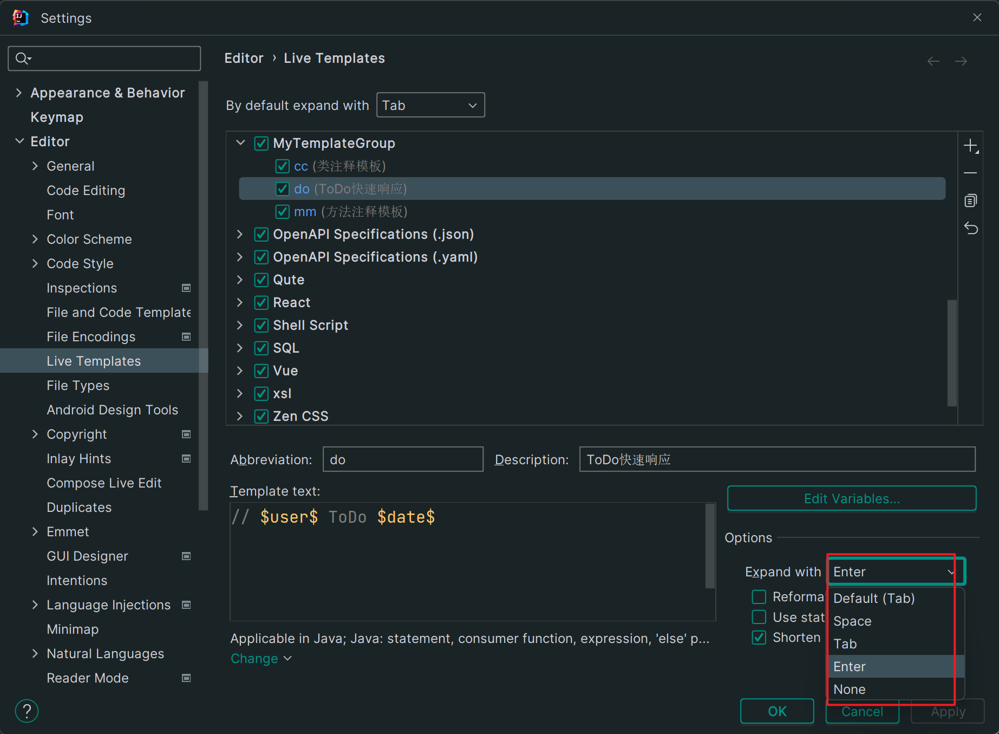

# `ToDo`

在日常开发中，使用`TODO`标记能够让我们很快速的找到上次未完成的内容代码上，提高开发效率，以下就是我总结的`TODO`标记的使用教程

## 编辑一个`ToDo`

`TODO`就是普通的 `// `注释添加一个`TODO`标识，目的是很快找到这个注释的代码，提高开发效率

```java
// TODO 这个接口需要调试
```

用`TODO`标记的注解可以通过下边的`TODO`导航栏来快速找到，如下图


## IDEA中`ToDo`默认配置

在IDEA中`ToDo`的默认配置位于**File=>Settings…=>Editor=>Live Templates=>AndroidComments**下


在代码中，我们可以直接用`todo`来快速调用该模板


## 自定义`ToDo`配置

首先打开 **File=>Settings…=>Editor=>Live Templates**

点击加号可以选择新建模板或模板组，**`Template Group...`即新建模板组，`Live Template`即新建模板**

下图中我已新建了模板组，故点击`Live Template`新建模板即可


点击`Live Template`后在下方对该模板进行编辑


编辑完名称和模板内容后，若模板内容中用到了函数，则需要点击`Edit Variables`按钮对函数进行编辑


`Expand with`选项可设置该模板快速响应后通过哪个按钮进行调用



完成后还需要选择该模板作用的范围，点击`Define`选择即可


完成后点击保存，在代码中输入快速响应名称即可


## 设置`ToDo`过滤器

在多人开发时，大家都可能编写TODO标签，为了在TODO中快速查找自己的标签，那么你就要自定义一个TODO标签，使用过滤器来筛选

首先打开 **File=>Settings…=>Editor=>ToDo**


点击加号添加过滤器


过滤器定义完后，还需要添加到`Filters`当中


完成后就可以通过过滤器直接找到匹配的`ToDo`标签了

